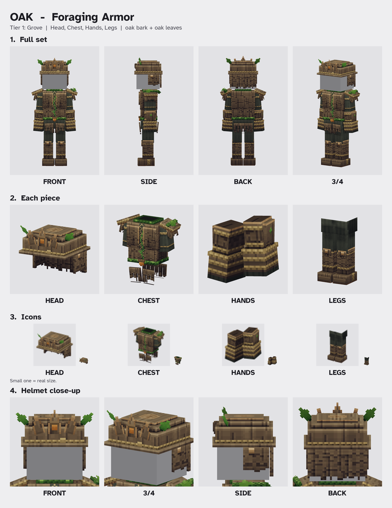
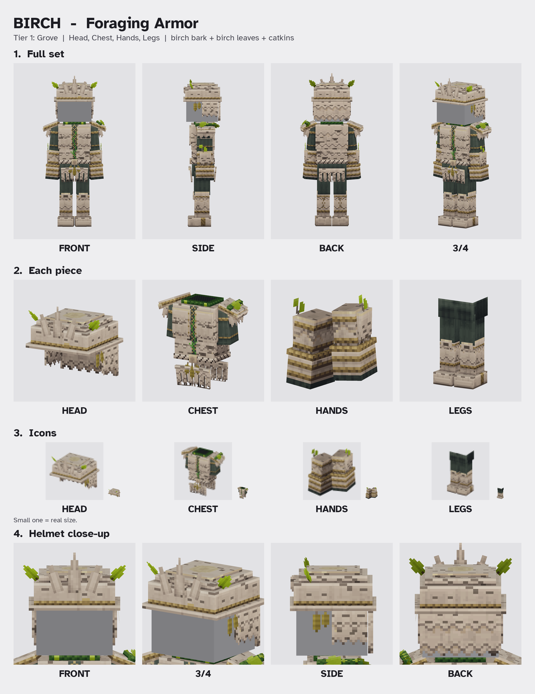
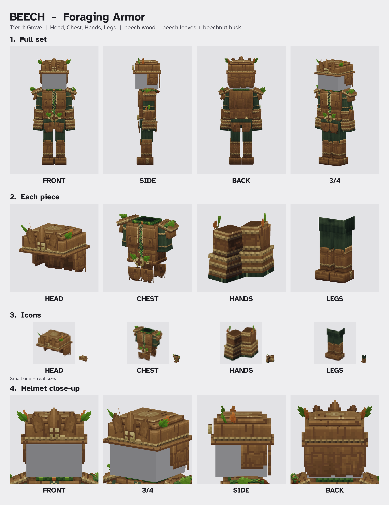
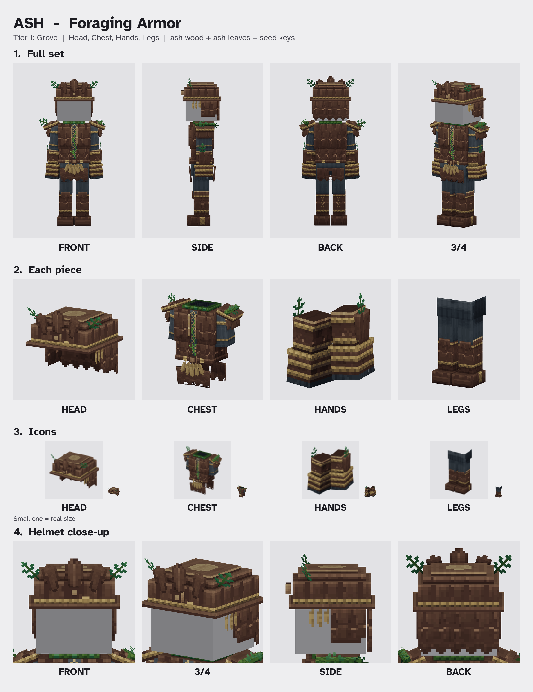
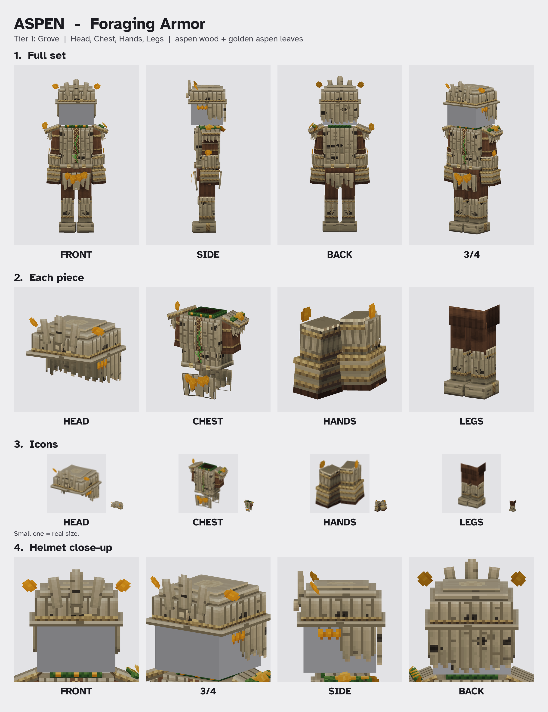
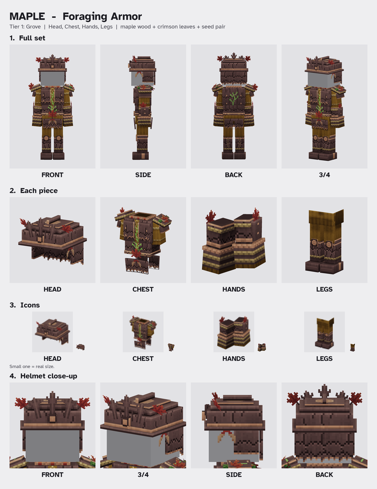
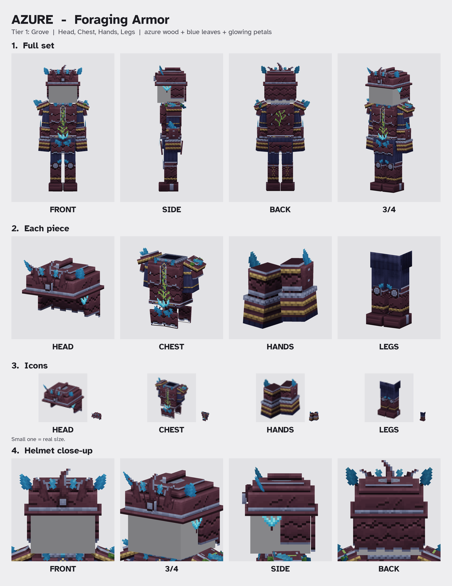

# Gathering armor: Foraging (one set per tree)

## Tier progression rule (all foraging tiers)

Skyy 2026-10-09: "Beautiful I want the armor sets consistent across the set, but each set should be a little different
visually, so they start simple and get a little cooler each set you get to that's better".

- One consistent family look across ALL tiers (same bark-plate armor, same fit).
- Trees in the same tier are EQUAL in coolness: only the wood colours, plate shape and mark change.
- Each higher tier is visibly a bit cooler than the last. F1 Grove = simple. F2 = a clear but modest step up.
  F3, F4 and F5 keep escalating (F5 the most impressive).

## OAK (F1 Grove)

**v2 (2026-10-09, APPROVED by Skyy: "they all look great!"):** repainted in the in-game Oak wood colours (Skyy: "make sure to
match each armor set to its in game wood variant." / "Yes, redo Oak and Birch to match their in-game wood"): red-brown
oak bark, orange-tan heartwood on cut rims, the game's oak-leaf green. Same models, shapes and acorn mark (textures only).

Status: APPROVED by Skyy 2026-10-08: "Yes, the Oak armor looks good, commit it". Not yet seen in game.

Skyy: "lets still make the farming and gathering armor, but use vanilla for mining, and armory for combat gear."
Skyy: "do a design per tree type in that set, so every hardwood gets its own design in that trees color"



## Files
| What | Path |
|---|---|
| Models + textures | `Common/Items/Armors/SkyyForaging/F1_Grove/Oak/{Head,Chest,Hands,Legs}.blockymodel` + `<Piece>_Texture.png` |
| Icons (64x64) | `Common/Icons/ItemsGenerated/Armor_Foraging_Oak_{Head,Chest,Hands,Legs}.png` |
| Blockbench projects | `source/F1_Grove/Oak/{Head,Chest,Hands,Legs}.bbmodel` (textures embedded; one folder per tree so the shared `source/` never clashes) |
| Review sheet | `sheet-oak.png` |
| Hashes, node lists | `manifest.json` |

Path note: ART-RESUME has two spellings for the icon names. This uses the tree-name one from the
Foraging bullet: `Armor_Foraging_<Tree>_<Piece>.png`.

## Look
- Copper-tier echo (tier 1) from the approved concept: layered bark plates with jagged edges, a laced
  gap down the chest with a faint green sap vein, a twisted vine belt, jagged bark tassels front and back.
- Oak colours: grey-brown furrowed oak bark, pale cut-oak rims, oak-leaf green, twine rope, moss-grey cloth.
- Oak extras: an acorn belt clasp and an acorn badge on the helmet.
- Head: open-face bark helmet with a brim, a small 3-point bark crown and 2 oak leaves (face stays visible).
- Chest: bark cuirass, 2 breast plates, rounded bark shoulder plates, ONE vine with 2 leaves over the LEFT shoulder, cloth sleeves with rope bands.
- Hands: bark bracers with rope bands, fingerless rope-wrapped bark gauntlets.
- Legs: moss-grey cloth trousers, bark knee caps, bark greaves with 2 rope bands, bark boots with a rope wrap.
- Not bulky: plates sit about 1 unit off the body, same as the Dark Leather set.

## Format
Hytale `.blockymodel` "character" attachments (root nodes named after player bones, `isPiece`), 64 units per
block, 1 texel per unit (same density as vanilla armor), integer box sizes, flat shading, textures in 32 px steps.
Mirrored L-/R- parts share texels (negative stretch, no mirror flag). Original geometry and pixels only.

| Piece | Boxes | Leaf quads | Texture |
|---|---|---|---|
| Head | 10 | 2 | 96x128 |
| Chest | 18 | 2 | 96x128 |
| Hands | 8 | 0 | 96x32 |
| Legs | 9 | 0 | 96x64 |

## Checked
- `validate_foraging.py`: structure, UVs in bounds / no overlaps, alpha 0/255 only, no pure black or white,
  textures in 32 px steps, icons 64x64, byte-identical rebuild. PASS.
- `check_fit_foraging.py`: rest-pose fit on the player rig. Remaining overlaps are only arms touching the torso at rest
  (like vanilla) and the front tassels just touching the trousers (0.07 units).
- Blockbench 5.2.1 + Hytale Models plugin 0.10.0: every piece opens as `hytale_character` with no validator warnings
  and no console errors; the plugin's own "Import Attachment" puts all 4 pieces on the right bones of the vanilla
  player; re-export round trip matches (only the plugin's added `isPiece: false` flags differ).
- NOT checked in game yet.

## Decisions (Skyy kept every default, 2026-10-08)
1. Tier folder name: `F1_Grove` (default). Could be `Grove` or `T1` instead.
2. Helmet: open-face bark helmet with the crown on it (ART-RESUME default "helmet in every tier"). The design doc
   only has a bark crown. Easy to switch to crown-only.
3. Sap glow: very faint (tier 1). Could be stronger.
4. Acorn clasp + acorn helmet badge as the Oak mark (default yes).
5. Vine with leaves on the LEFT shoulder only (concept). Could be both shoulders.
6. Front tassels pass through the legs when walking (vanilla skirts do too).
7. No item / recipe JSON yet: art only.

## BIRCH (F1 Grove)

**v2 (2026-10-09, APPROVED by Skyy: "they all look great!"):** repainted in the in-game Birch wood colours (same Skyy quotes as
Oak v2): warm cream bark with soft vertical fibre streaks, grey-brown lenticels and knots (softer than v1's black),
pale tan heartwood, the game's lime yellow-green birch leaves. Same models, shapes and catkin mark (textures only).

Status: APPROVED by Skyy 2026-10-09: "Yes, the Birch armor looks good, commit it". Not yet seen in game.
Defaults kept: separate models per tree, catkins as the mark, rounded edges, vine + faint sap kept.



| What | Path |
|---|---|
| Models + textures | `Common/Items/Armors/SkyyForaging/F1_Grove/Birch/{Head,Chest,Hands,Legs}.blockymodel` + `<Piece>_Texture.png` |
| Icons (64x64) | `Common/Icons/ItemsGenerated/Armor_Foraging_Birch_{Head,Chest,Hands,Legs}.png` |
| Blockbench projects | `source/F1_Grove/Birch/{Head,Chest,Hands,Legs}.bbmodel` |
| Review sheet | `sheet-birch.png` |

- Same F1 family and the same fit as Oak (geometry derived from `tools/art/ga_oak.py` in `ga_birch.py`).
- Colours: off-white papery birch bark (never pure white), charcoal lenticel dashes and black knot "eyes", pale
  yellow heartwood where the bark peels, light spring-green leaves, cool sage cloth.
- Birch mark: hanging CATKINS. 3 hang under a carved heartwood knot clasp on the belt, and 2 hang at the left temple of the helmet.
- Shape changes vs Oak: taller, thinner 3-point crown; ROUNDED (scalloped) plate edges and hems instead of jagged;
  rolled-bark curls along both shoulder plates and the tops of the front tassels; a twisted birch-bark belt (no ivy);
  small twig sprigs (2 leaves) tucked into the bracer rope bands; toothed birch leaves.
- Ideas from studying The Armory mod (nothing copied): long smooth grain bands instead of speckle, a soft outline +
  light rim on every plate edge, and alpha-cut quads for small silhouette details (catkins, sprigs) so nothing gets bulky.
- Size: 48 boxes + 11 quads. Textures Head 96x128, Chest 96x128, Hands 96x32, Legs 96x64.
- Checked the same way as Oak (structure PASS, byte-identical rebuild, fit, Blockbench + Hytale plugin: no validator
  issues, all 4 pieces attach to the vanilla player). Not checked in game.

## BEECH (F1 Grove)

Status: APPROVED by Skyy 2026-10-09 (v2): "Yes, the Beech armor looks good, commit it". Not yet seen in game.
v1 feedback (Skyy): "beech looks too much like iron, i need to look a little more like beech wood in the game".
Defaults kept: small copper accent leaf, warmer + lighter than Oak with vertical grain, loden-green cloth, husk badge on the crown.



| What | Path |
|---|---|
| Models + textures | `Common/Items/Armors/SkyyForaging/F1_Grove/Beech/{Head,Chest,Hands,Legs}.blockymodel` + `<Piece>_Texture.png` |
| Icons (64x64) | `Common/Icons/ItemsGenerated/Armor_Foraging_Beech_{Head,Chest,Hands,Legs}.png` |
| Blockbench projects | `source/F1_Grove/Beech/{Head,Chest,Hands,Legs}.bbmodel` |
| Review sheet | `sheet-beech.png` |

- Same F1 family and the same fit as Oak (geometry derived from `tools/art/ga_oak.py` in `ga_beech.py`).
- Colours follow the in-game Beech wood (hues only, sampled from the game's Beech trunk / log end / planks / leaves;
  our own pixels): warm orange-brown bark with long vertical grain streaks and a few small knots, tan heartwood with a
  dark red-brown rim on cut edges, the game's fresh beech green leaves with one copper accent leaf per side, deep
  loden-green cloth.
- Reads as WOOD, not metal: every plank its own tone, gentle bevels (no bright hard rims), slightly wavy hand-cut plate
  edges with small notches and rounded corners.
- Beech mark: the BEECHNUT HUSK (pale spiky four-part husk split open around a dark nut) as the belt clasp, hanging on
  a twig with two beech leaves, plus a small husk badge at the base of the middle crown point.
- Shape vs Oak (jagged) and Birch (rounded): broad overlapping wooden plates, leaf-shaped crown points, a second plate
  on each shoulder, broad tassel panels, smooth beech belt, beech leaves on the right shoulder + vine on the left.
- Size: 47 boxes + 13 quads. Textures Head 96x128, Chest 96x128, Hands 96x32, Legs 96x64.
- Checked the same way as Oak and Birch (structure PASS, byte-identical rebuild, fit, Blockbench + Hytale plugin: no
  validator issues, all 4 pieces attach to the vanilla player). Not checked in game.

## ASH (F1 Grove)

Status: APPROVED by Skyy 2026-10-09: "they all look great!". Not yet seen in game.
Defaults kept: five seed keys on the belt, slate cloth, bark matched to the game.



| What | Path |
|---|---|
| Models + textures | `Common/Items/Armors/SkyyForaging/F1_Grove/Ash/{Head,Chest,Hands,Legs}.blockymodel` + `<Piece>_Texture.png` |
| Icons (64x64) | `Common/Icons/ItemsGenerated/Armor_Foraging_Ash_{Head,Chest,Hands,Legs}.png` |
| Blockbench projects | `source/F1_Grove/Ash/{Head,Chest,Hands,Legs}.bbmodel` |
| Review sheet | `sheet-ash.png` |

- Same F1 family and the same fit as Oak (geometry derived from `tools/art/ga_oak.py` in `ga_ash.py`).
- Colours follow the in-game Ash wood (hues only, sampled from the game's Ash trunk / log end / hardwood planks /
  leaves; our own pixels): dark plum-brown bark with lighter ridges around long narrow diamond furrows (ash bark),
  pale tan heartwood on cut edges, the game's deep blue-green ash leaves (pinnate: leaflet pairs on a stem),
  straw-tan seed keys, cool slate cloth.
- Ash mark: the SAMARA cluster - 5 winged seed keys fanning down from a carved heartwood clasp on the belt, and a
  bunch of 3 keys at the left temple.
- Shape vs Oak (jagged), Birch (rounded), Beech (broad smooth): CHEVRON plates (each plate ends in a shallow V, rows
  offset so they make a diamond lattice), V-pointed hems, samara-wing crown points, a raised ridge along each shoulder.
- Size: 47 boxes + 13 quads. Textures Head 96x128, Chest 96x128, Hands 96x32, Legs 96x64.
- Checked the same way as the others (structure PASS, byte-identical rebuild, fit, Blockbench + Hytale plugin: no
  validator issues, all 4 pieces attach to the vanilla player). Not checked in game.

## ASPEN (F1 Grove)

Status: APPROVED by Skyy 2026-10-09: "Yes, the Aspen armor looks good, commit it". Not yet seen in game.
Defaults kept: golden leaves, russet cloth, eye scars as drawn.



| What | Path |
|---|---|
| Models + textures | `Common/Items/Armors/SkyyForaging/F1_Grove/Aspen/{Head,Chest,Hands,Legs}.blockymodel` + `<Piece>_Texture.png` |
| Icons (64x64) | `Common/Icons/ItemsGenerated/Armor_Foraging_Aspen_{Head,Chest,Hands,Legs}.png` |
| Blockbench projects | `source/F1_Grove/Aspen/{Head,Chest,Hands,Legs}.bbmodel` |
| Review sheet | `sheet-aspen.png` |

- Same F1 family and the same fit as Oak (geometry derived from `tools/art/ga_oak.py` in `ga_aspen.py`).
- Colours follow the in-game Aspen wood (hues only, sampled from the game's Aspen trunk / log end / softwood planks /
  golden aspen leaves; our own pixels): pale khaki-cream bark with soft horizontal bands, short dark dashes and dark
  EYE-SHAPED scars (aspen bark), pale cream heartwood with rings, the game's golden-orange aspen leaves, russet cloth
  (the colour of the aspen's softwood planks).
- Aspen mark: TREMBLING ROUND LEAVES - 4 round golden leaves on long stalks hanging at different angles from a carved
  heartwood clasp on the belt, plus a bunch of 3 at the left temple and single leaves on the shoulder, bracers and crown.
- Shape vs Oak (jagged), Birch (rounded), Beech (broad smooth), Ash (chevrons): SLENDER TALL VERTICAL SLATS - narrow
  upright plates with thin gap lines, ending at staggered lengths with rounded tips and open gaps at the hems (light,
  airy); slim round-topped spire crown points; longer slat tassels.
- Size: 45 boxes + 12 quads. Textures Head 96x128, Chest 96x128, Hands 96x32, Legs 96x64.
- Checked the same way as the others (structure PASS, byte-identical rebuild, fit, Blockbench + Hytale plugin: no
  validator issues, all 4 pieces attach to the vanilla player). Not checked in game.

## F2 AUTUMN + AZURE - what tier 2 adds (same for every F2 tree)

A clear but modest step up from F1 (tier progression rule above). Built by `tools/art/ga_f2.py`, so every F2 tree (Maple, Azure) gets
exactly the same upgrades; only the wood colours, plate shape and mark change.

1. An extra shoulder layer: a raised cap plate on each pauldron, with a heartwood rim and a sap line along the top.
2. Wooden PEGS (like rivets) on the cuirass, breast plates, plackart, belt, bracers and greaves.
3. STRONGER SAP: a brighter, thicker chest vein with 4 forked branches and a soft halo, plus a second vein up the back.
4. Belt upgrade: heartwood trim bands, pegs and a bigger round carved knot boss as the clasp.
5. A helmet CREST (a carved ridge from brow to nape with a sap line) and a taller middle crown point.
6. Heartwood brow band, collar and glove cuffs (F1: rope / vine), and round knot-boss knee caps.

Tier ladder (APPROVED by Skyy 2026-10-09 with the F2 sets, defaults kept):
- F1: simple (done).
- F2: pegs, shoulder cap, brighter sap, belt boss, helmet crest.
- F3: angular plates, bigger layered shoulders, a gorget, sap glow up the arms.
- F4: thorn and spike accents, tall pauldrons, a glowing chest knot, double crest.
- F5: ornate - gold inlay, glowing gem knots, a winged or tall crown, the brightest sap (the most impressive).

## MAPLE (F2 Autumn)

Status: APPROVED by Skyy 2026-10-09: "They look great! A little more blue on the azure, and we should be good". Not yet seen in game.
Defaults kept: mustard cloth, maple leaf + seed pair mark, `F2_Autumn` folder, green sap.



| What | Path |
|---|---|
| Models + textures | `Common/Items/Armors/SkyyForaging/F2_Autumn/Maple/{Head,Chest,Hands,Legs}.blockymodel` + `<Piece>_Texture.png` |
| Icons (64x64) | `Common/Icons/ItemsGenerated/Armor_Foraging_Maple_{Head,Chest,Hands,Legs}.png` |
| Blockbench projects | `source/F2_Autumn/Maple/{Head,Chest,Hands,Legs}.bbmodel` |
| Review sheet | `sheet-maple.png` |

- Colours follow the in-game (Crimson) Maple wood (hues only, sampled from the game's Maple trunk / log end / redwood
  planks / leaves / seeds; our own pixels): mauve-brown bark with long vertical fibres and dark cracks, peach heartwood,
  the game's crimson maple leaves, tan-and-red maple seeds, mustard cloth (autumn).
- Shape: LOBED plates (every plate edge and hem cut into maple-leaf lobes), maple-leaf crown points.
- Maple mark: a big crimson MAPLE LEAF on the knot-boss belt clasp with a SAMARA PAIR (the double-winged seed) under it,
  and a samara pair at the left temple.
- Size: 48 boxes + 10 quads. Textures Head 96x128, Chest 128x96, Hands 96x32, Legs 96x64.
- Checked like F1 (structure PASS, byte-identical rebuild, fit, Blockbench + Hytale plugin: no validator issues, all 4
  pieces attach to the vanilla player). Not checked in game.

## AZURE (F2 Autumn)

Status: APPROVED by Skyy 2026-10-09 (v3): "Yes, Azure v3 looks good, commit it". Not yet seen in game.
Earlier feedback: v1 "They look great! A little more blue on the azure, and we should be good" / v2 "Thats a little too much.
Take the V1 azure, and make the parts that are already blue a little brighter blue, and add some more leaves to the design."



| What | Path |
|---|---|
| Models + textures | `Common/Items/Armors/SkyyForaging/F2_Autumn/Azure/{Head,Chest,Hands,Legs}.blockymodel` + `<Piece>_Texture.png` |
| Icons (64x64) | `Common/Icons/ItemsGenerated/Armor_Foraging_Azure_{Head,Chest,Hands,Legs}.png` |
| Blockbench projects | `source/F2_Autumn/Azure/{Head,Chest,Hands,Legs}.bbmodel` |
| Review sheet | `sheet-azure.png` |

- Colours start from the in-game Azure wood (hues sampled from the game's Azure trunk / log end / leaves / glowing
  petals; our own pixels): plum-purple bark with swirling diagonal grain, indigo cloth; the blue parts (azure leaves,
  blue-silver heartwood, glowing cyan petals) a little brighter in v3.
- More leaves (v3): 12 small flat azure leaves - helmet crown, collar, shoulder caps, belt, bracers, knees.
- Shape: CRESCENT plates (each lower edge curves up between sharp points), curved crescent crown points.
- Azure mark: a spray of 3 GLOWING AZURE PETALS rising from the knot-boss belt clasp (2 blue leaves hang below it), and a
  petal spray at the left temple.
- Size: 48 boxes + 23 quads. Textures Head 96x128, Chest 128x96, Hands 96x32, Legs 64x128.
- Checked like F1 (structure PASS, byte-identical rebuild, fit, Blockbench + Hytale plugin: no validator issues, all 4
  pieces attach to the vanilla player). Not checked in game.

## F3 SAVANNA - what tier 3 adds (same for every F3 tree)

Built by `tools/art/ga_f3.py` on top of everything tier 2 has (`ga_f2.py`), identical for Gumboab, Dry, Bottletree, Palo
(approved ladder: "F3 angular plates, bigger layered shoulders, a gorget, sap glow up the arms"):
- ANGULAR plates (each tree its own angular edge) + cut corners on breast plates, tassels, cheek guards, helmet back, bracer plates.
- BIGGER, LAYERED shoulders: wider pauldron + cap, a carved ridge on the cap, a second lame under the first.
- A GORGET: a taller neck-guard ring + a pointed front plate with a sap drop.
- SAP GLOW UP THE ARMS: a glowing vein up each arm (bracer, sleeve, shoulder lames).
Colours from each tree's in-game log / leaves / planks (own pixels). Status: APPROVED by Skyy 2026-10-09 ("<Tree> looks good, commit it"
for each tree). Bottletree and Palo are v2: the bark was too dark next to the real Assets.zip textures, so it was lightened
(approved 2026-10-09: "All look great, commit the 4 colour fixes and all 10 F5 sets"). Not seen in game.

| Tree | Bark (in game) | Plate edge | Mark | Cloth |
|---|---|---|---|---|
| Gumboab | smooth grey-taupe, soft folds | terraced (flat steps, angled ends) | fan of 5 sage blades | ochre |
| Dry | warm brown, dark vertical fibres | splinter saw-tooth | 3 yellow puff blossoms | rust |
| Bottletree | pale grey-cream, soft smudges | crenellated (square teeth) | little bottle tree | deep teal |
| Palo | olive green, lenticel dashes | chevron (big V) | 2 orange palo blossoms | chocolate |

Files: `Common/Items/Armors/SkyyForaging/F3_Savanna/<Tree>/`, icons `Armor_Foraging_<Tree>_<Piece>.png`, `source/F3_Savanna/<Tree>/`,
`sheet-<tree>.png`. Each 53 boxes + 9 quads. Checked like F1 / F2 (structure PASS, byte-identical rebuild, fit, Blockbench +
Hytale plugin: no validator issues).

## F4 NORTHERN - what tier 4 adds (same for every F4 tree)

Built by `tools/art/ga_f4.py` on top of everything tier 3 has (`ga_f3.py`, `ga_f2.py`), identical for Redwood, Fir, Cedar,
Poisoned, Spiral (approved ladder: "F4 thorn / spike accents, tall pauldrons, a glowing chest knot, double crest"):
- THORNS: heartwood thorn spikes, two on each shoulder cap, two out of each bracer plate.
- TALL PAULDRONS: an upright guard plate on the outer end of each pauldron.
- A GLOWING CHEST KNOT between the breast plates (glowing sap rings).
- A DOUBLE CREST: two thorny crest ridges over the helmet.
Status: APPROVED by Skyy 2026-10-09 ("all look great! commit all"). Fir, Cedar, Poisoned colours checked against Assets.zip.
Redwood (heartwood a little deeper) and Spiral (bark lighter) are v2 colour fixes to match the in-game wood (approved 2026-10-09).
Not seen in game.

| Tree | Bark (in game) | Plate edge | Mark | Cloth |
|---|---|---|---|---|
| Redwood | red-brown, stringy fibres | narrow spike teeth | redwood cone + needles | navy |
| Fir | very dark brown, rough flakes | fir tiers (wide V + point) | little fir tree | oatmeal wool |
| Cedar | orange-brown fibre strips | pointed arches | cedar rose | burgundy |
| Poisoned | near-black purple, glowing yellow-green cracks | barbed hooks | violet thorn leaf + toxic drop | dark moss |
| Spiral | pale mint-grey, crackled | soft curls | aqua spiral | steel blue |

Files: `Common/Items/Armors/SkyyForaging/F4_Northern/<Tree>/`, icons `Armor_Foraging_<Tree>_<Piece>.png`,
`source/F4_Northern/<Tree>/`, `sheet-<tree>.png`. Each 65 boxes + 9 quads.

## F5 WASTES - what tier 5 adds (same for every F5 tree)

Built by `tools/art/ga_f5.py` on top of everything tier 4 has (`ga_f4.py`, `ga_f3.py`, `ga_f2.py`), identical for every F5 tree
(approved ladder: "F5 ornate - gold inlay, glowing gem knots, a winged or tall crown, the brightest sap"):
- GOLD INLAY: a thin gold line inside the edge of the breast plates, gorget, pauldron guards, bracer plates, greaves, brim.
- GLOWING GEM KNOTS: the chest knot becomes a big faceted gem in gold; small gems on the pauldron guards, knees and brow.
- A WINGED, TALLER CROWN: taller crown points + two swept, gold-edged wings on the helmet sides.
- THE BRIGHTEST SAP: every sap line glows a brighter, paler green.
Colours sampled from each tree's own textures in Assets.zip (log side, log top, leaves; own pixels). Status: APPROVED by Skyy 2026-10-09
("All look great, commit the 4 colour fixes and all 10 F5 sets"). Not seen in game.

| Tree | Bark (in game) | Plate edge | Mark | Cloth | Gem |
|---|---|---|---|---|---|
| Sallow | olive-gold, stringy | willow strands | golden catkins | plum | amber |
| Burnt | charcoal, cracked | jagged ember teeth | ember on a char log | ash grey | ember orange |
| Petrified | grey-brown stone cracks | stair steps | stone ring fossil | dusty violet | lilac |

Files: `Common/Items/Armors/SkyyForaging/F5_Wastes/<Tree>/`, icons `Armor_Foraging_<Tree>_<Piece>.png`, `source/F5_Wastes/<Tree>/`,
`sheet-<tree>.png`. Each 65 boxes + 9 quads from F4, plus 5 gem boxes and 2 wing quads. The `ga_<tree>.py`
files are the source.

## Rebuild
```
GA_DESIGN=ga_oak   python3 tools/art/make_foraging_armor.py      # models + textures (design ga_<tree>.py, painter ga_paint.py)
GA_DESIGN=ga_birch python3 tools/art/make_foraging_armor.py
GA_DESIGN=ga_beech python3 tools/art/make_foraging_armor.py
GA_DESIGN=ga_ash   python3 tools/art/make_foraging_armor.py
GA_DESIGN=ga_aspen python3 tools/art/make_foraging_armor.py
GA_DESIGN=ga_maple python3 tools/art/make_foraging_armor.py   # F2 trees: tier upgrades in ga_f2.py
GA_DESIGN=ga_azure python3 tools/art/make_foraging_armor.py
GA_DESIGN=ga_gumboab python3 tools/art/make_foraging_armor.py   # F3 trees (also ga_dry, ga_bottletree, ga_palo): tier upgrades in ga_f3.py
GA_DESIGN=ga_redwood python3 tools/art/make_foraging_armor.py   # F4 trees (also ga_fir, ga_cedar, ga_poisoned, ga_spiral): ga_f4.py
GA_DESIGN=ga_sallow python3 tools/art/make_foraging_armor.py   # F5 trees (also ga_burnt, ga_petrified, ga_bamboo, ga_camphor, ga_banyan,
                                                                #   ga_jungle, ga_bluefig, ga_fire, ga_crystalwood): ga_f5.py
python3 tools/art/make_foraging_icons.py art/gathering-armor F1_Grove Birch
python3 tools/art/make_foraging_sheet.py art/gathering-armor F1_Grove Birch
GA_TREE=Birch python3 tools/art/validate_foraging.py
python3 tools/art/make_foraging_manifest.py                      # one shared manifest for every tree
```
