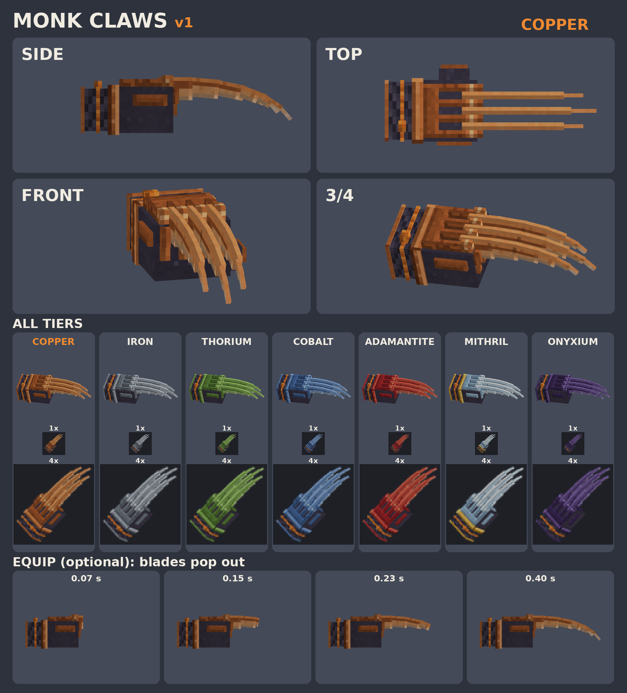

# Monk claws v1 (SkyyArmory_Fist_Claws_<Tier>)

Redesign Skyy asked for on 2026-10-08: "Monk claws next, but they need a redesign to look like this (with claws out ...)".
Skyy's reference picture is someone else's art: it is NOT in this folder or the repo. This design only takes the idea
(skeletal metal frame over the hand + wrist cuff + three long curved blades from the knuckles) and is drawn from scratch.

## What it is
- Black leather fist glove (`Handle`) with a metal skeleton on top: a carpal plate with a saffron Monk diamond, 4 finger bones,
  4 knuckle caps and 2 finger segments down the front of the fist. There are also bone strips on the thumb and pinky sides.
- Three long curved blades come out from between the knuckles. The middle blade is the longest. Each blade is 6 stepped segments that
  taper from 6 units deep to 1 and bend 0-49 degrees towards the palm. Each blade has a spine, a dark fuller and a bright honed edge.
- Wrist: a metal cuff ring with studs, a black leather strap wound round the wrist, a saffron cord + knot (Monk colour #f08a30),
  and a metal end rim.
- 44 boxes / 528 tris, 45 nodes. Texture 64x128 per tier (1 texel per unit = 64 px per block). Icons 64x64.
- Tiers (Lv bands as in the fist weapons): Copper 10-18, Iron 15-23, Thorium 20-28, Cobalt 25-38, Adamantite 35-43,
  Mithril 40-49 (silver-blue + gold cuff trim), Onyxium 50+ (black-violet). The colours are our own hex ramps; nothing is sampled from vanilla.

## Files
| What | Path |
|---|---|
| Model (one per tier, same geometry) | `Common/Items/Weapons/Fist/SkyyArmory_Claws_<Tier>.blockymodel` |
| Texture | `Common/Items/Weapons/Fist/SkyyArmory_Claws_<Tier>_Texture.png` |
| Icon | `Common/Icons/ItemsGenerated/SkyyArmory_Fist_Claws_<Tier>.png` |
| Equip animation (optional) | `Common/Items/Weapons/Animations/SkyyArmory_Claws/SkyyArmory_Claws_Extend.blockyanim` (24 frames = 0.4 s, holds) |
| Blockbench projects | `source/SkyyArmory_Claws_<Tier>.bbmodel` |
| Generator | `tools/art/make_monk_claws.py` (+ `mc_render.py`, `make_monk_claws_sheet.py`, `bb_validate_claws.js`) |

The paths and ids are the same as the existing local fist build (`models-local/art/fists`), so these files can replace those claws directly.

## How it attaches
This uses the held-weapon frame from `tools/art/make_fists.py`: the root is `R-Attachment` (isPiece) at the centre of the hand cube.
+z points to the knuckles and blades, -x is the back of the hand and +y is the thumb side. The glove is 1 unit bigger than the bare
hand. The glove body is named `Handle`. The blade tips are `Blade1_6`, `Blade2_6` and `Blade3_6`, which can be used for trail effects.

## Equip animation
In `Claws_Extend`, each blade segment grows out from its base, one after another, with a 1-frame stagger between blades.
It uses shapeStretch + a matching position key + shapeVisible, and the last key holds. The rest pose is "claws out",
so if the game never plays this animation, the claws still show fully extended.

## Edit / regenerate
`python3 tools/art/make_monk_claws.py art/monk-claws` and then `python3 tools/art/make_monk_claws_sheet.py art/monk-claws`.
The generator is deterministic: two runs give the same bytes. To edit by hand, open `source/*.bbmodel` in Blockbench with the Hytale Models plugin.

## Verified (box, 2026-10-08)
- All 7 models open in Blockbench 5.2.1 + Hytale Models 0.10.0 as `hytale_character` (45 groups, 44 cubes) and their textures auto-load.
  The Validator shows no errors and no warnings.
- The animation auto-loads with 18 animators, all bound to nodes. It plays in Blockbench the same way it looks on the sheet.

## UNVERIFIED (in game)
1. That the game plays an item-model `.blockyanim` when the weapon is equipped, and which item-JSON key triggers it.
2. The animation folder location. It follows the plugin's `<model dir>/../Animations/<folder>/` convention.
3. Whether `RenderDualWielded` mirrors the left claw. If it does not, the left blades sit on the palm side.
4. The IconProperties for the item JSON. The PNG icons come from our own renderer, so the local session should fit them.
5. The painted light assumes a light from the back of the hand. In-game shading may make the glove look a little darker.

## Open questions for Skyy (default in brackets)
1. Equip animation: keep the pop-out animation? [keep it as an optional extra. If the engine can't trigger it, ship without it]
2. Blade thickness: 2 units at the base and 1 at the tip. [keep as is]
3. Should the middle blade be longer? [yes, it is 2 units longer]
4. Saffron Monk cord + diamond on every tier? [yes, on every tier]
5. Gold trim: Mithril only, to match the wands. [Mithril only, Onyxium stays black-violet]
6. Same geometry on every tier, with only the colours changing? [yes for v1. Tier extras such as Adamantite barbs can come later]
