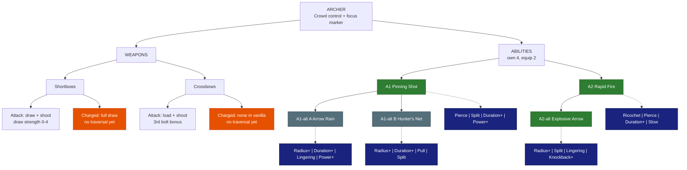

# 🏹 Archer - Crowd control

| | |
|---|---|
| 🎯 **Main role** | Crowd control |
| 🎯 **Second role** | Focus marker / ranged damage |
| 📈 **Class skill** | Archery |
| 💬 **In one line** | Sturdy at range. Pins mobs in place. Marks targets for the party. |

Crossbows stay loaded (live since SkyySkills 0.4.5).

Numbers are placeholders. Labels: 🟢 Locked · 🔵 Proposed · 🟠 Open - see [README.md](README.md).

&nbsp;

## 🗺️ Map

&nbsp;

## ⚔️ Weapons

### Shortbows

🟠 **Open** - needs a traversal

- **Attack:** vanilla draw-and-shoot (draw strength 0-4). Vanilla Signature Volley.

- **Charged:** a full draw = the strongest shot. **No movement** in vanilla.

- 🔵 **Proposed traversal - Grapple Arrow:** a full-draw shot into a block pulls you to it.

### Crossbows

🟠 **Open** - needs a traversal

- **Attack:** vanilla load + shoot. The 3rd bolt in a row on one target hits harder. Bolts stay loaded (SkyySkills).

- **Charged:** vanilla has no hold-to-charge.

- 🔵 **Proposed traversal - Dodge Roll:** roll the way you move and reload instantly.

&nbsp;

## ✨ Abilities

You own 4. You equip 2.

### A1 · Pinning Shot

🟢 **Locked** - rooted enemies are marked

- **Does:** a piercing arrow (30 blocks).

- Every enemy hit is **Rooted ~2 s** and **Marked 6 s** (takes 15% more damage from everyone).

- **Levels:** +1% Mark per level.

**Modifiers**

- 📌 **Pierce** - +1 enemy per level.

- 🔱 **Split** - fires a fan of 3 arrows.

- ⏳ **Duration+** - longer root and mark.

- 💪 **Power+** - bigger Mark bonus.

### A1-alt A · Arrow Rain

🔵 **Proposed** - pick A or B

- **Does:** arrows rain on a 6-block area for 3 s. Enemies inside are **Slowed**.

- Enemies still inside after 2 s are **Rooted 1.5 s** and **Marked**.

**Modifiers**

- ⭕ **Radius+** / ⏳ **Duration+** - bigger / longer rain.

- 🔥 **Lingering** - the ground stays a slowing zone after the rain.

- 💪 **Power+** - more damage + stronger Mark.

### A1-alt B · Hunter's Net

🔵 **Proposed** - pick A or B

- **Does:** a net shot bursts into a **4-block root zone** for 3 s.

- Everything caught is **Marked 8 s**.

**Modifiers**

- ⭕ **Radius+** / ⏳ **Duration+** - bigger net / longer root.

- 🧲 **Pull** - the net drags enemies toward its centre.

- 🔱 **Split** - fires 3 smaller nets.

### A2 · Rapid Fire

🟢 **Locked**

- **Does:** **15 arrows in 3 s** (each about half a normal shot).

**Modifiers**

- 🎱 **Ricochet** - arrows bounce to +1 enemy per level.

- 📌 **Pierce** - arrows pass through +1 enemy per level.

- ⏳ **Duration+** - more arrows.

- 🐌 **Slow** - each hit slows a little.

### A2-alt · Explosive Arrow

🟢 **Locked**

- **Does:** your next charged shot does **2x damage** in an explosive 4-block AoE.

**Modifiers**

- ⭕ **Radius+** - bigger blast.

- 🔱 **Split** - the blast throws out 3 bomblets.

- 🔥 **Lingering** - leaves a burning patch.

- 💥 **Knockback+** - the blast pushes enemies away.

&nbsp;

## 🧩 Modifier pool

Each ability offers 4 of these. You equip 2.

<!-- POOL START - tools/class_pages.py copies this block into every class file (python tools/class_pages.py --sync-pool) -->
- ⏳ **Duration+** - lasts longer · each level: more time.

- ⭕ **Radius+** - bigger area · each level: more blocks.

- 💪 **Power+** - stronger main effect (damage, heal, shield, buff) · each level: more %.

- 💧 **Efficiency** - costs less Mana / Stamina · each level: lower cost.

- 🔱 **Split** - splits into 3 weaker copies (projectiles, lines) · each level: stronger copies.

- 🎱 **Ricochet** - PROJECTILES only: the shot flies on to the next enemy after a hit (walls block it, it can miss) · each level: +1 bounce.

- 📌 **Pierce** - passes through enemies · each level: +1 enemy.

- ⛓️ **Chain** - EFFECTS only (heals, buffs, debuffs, poison, hooks): jumps instantly to the next target in range - enemies, or allies for support · each level: +1 jump.

- 🔥 **Lingering** - leaves a zone behind (fire, poison, light) · each level: longer zone.

- 🐌 **Slow** - adds a slow · each level: stronger slow.

- 💥 **Knockback+** - pushes enemies away · each level: farther.

- 🧲 **Pull** - draws enemies in · each level: stronger pull.

- 👣 **Follow** - a placed zone moves with you instead · each level: bigger zone.

- 🩸 **Leech** - heals you for part of the damage · each level: more %.

- 🛡️ **Ward** - adds a small shield (you, or allies for support abilities) · each level: bigger shield.

- ⚡ **Haste** - attack + move speed for a few seconds after use · each level: longer.

- 🔁 **Echo** - repeats once after 1 s at reduced strength · each level: stronger echo.
<!-- POOL END -->

&nbsp;

## 🌳 Class tree paths

Ideas - pick one.

- **Trapper** - roots and nets last longer, rooted enemies take more.

- **Sharpshooter** - long-range single-target damage, Marks stack harder.

- **Stormbow** - Rapid Fire / Explosive Arrow multi-target.

&nbsp;

## 🟠 Open

- Traversals for shortbows and crossbows (Grapple Arrow / Dodge Roll proposed).

&nbsp;

## 📜 Change log

- 2026-10-05: refined for easy reading (same facts, new layout).

- 2026-10-04: modifier pool table added under the abilities (Skyy).

- 2026-10-04: file created; Pinning Shot + Mark combined, Rapid Fire / Explosive Arrow LOCKED (Skyy).
