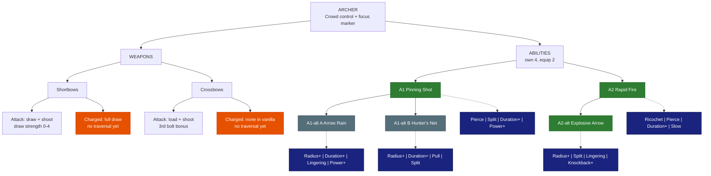

# Archer - Crowd control

**Main role:** crowd control. **Second role:** focus marker / ranged damage. **Class skill:** Archery. **Identity:** sturdy at range, pins
mobs in place, marks targets for the party. Crossbows stay loaded (live since SkyySkills 0.4.5). *Numbers are placeholders. Legend in [README.md](README.md).*

## Weapons

| Weapon | Attack | Charged attack / traversal | Status |
|---|---|---|---|
| Shortbows | Vanilla draw-and-shoot (draw strength 0-4); vanilla Signature Volley | Full draw = the strongest shot; **no movement** in vanilla | **OPEN**: needs a traversal. *Proposed:* **Grapple Arrow** - a full-draw shot into a block pulls you to it |
| Crossbows | Vanilla load + shoot; the 3rd bolt in a row on one target hits harder; bolts stay loaded (SkyySkills) | Vanilla has no hold-to-charge | **OPEN**: needs a traversal. *Proposed:* **Dodge Roll** - roll the way you move and reload instantly |

## Abilities

### A1 - Pinning Shot (LOCKED: rooted enemies are marked)
| | |
|---|---|
| Does | A piercing arrow (30 blocks): every enemy hit is Rooted ~2 s and Marked 6 s (takes 15% more damage from everyone) |
| Levels | +1% Mark per level |
| Pierce | +1 enemy per level |
| Split | fires a fan of 3 arrows |
| Duration+ | longer root and mark |
| Power+ | bigger Mark bonus |

### A1-alt A - Arrow Rain (*proposed*, pick A or B)
| | |
|---|---|
| Does | Arrows rain on a 6-block area for 3 s: enemies inside are Slowed; those still inside after 2 s are Rooted 1.5 s and Marked |
| Radius+ / Duration+ | bigger / longer rain |
| Lingering | the ground stays a slowing zone after the rain |
| Power+ | more damage + stronger Mark |

### A1-alt B - Hunter's Net (*proposed*, pick A or B)
| | |
|---|---|
| Does | A net shot bursts into a 4-block root zone for 3 s; everything caught is Marked 8 s |
| Radius+ / Duration+ | bigger net / longer root |
| Pull | the net drags enemies toward its centre |
| Split | fires 3 smaller nets |

### A2 - Rapid Fire (LOCKED)
| | |
|---|---|
| Does | 15 arrows in 3 s (each about half a normal shot) |
| Ricochet | arrows bounce to +1 enemy per level |
| Pierce | arrows pass through +1 enemy per level |
| Duration+ | more arrows |
| Slow | each hit slows a little |

### A2-alt - Explosive Arrow (LOCKED)
| | |
|---|---|
| Does | Your next charged shot does 2x damage in an explosive 4-block AoE |
| Radius+ | bigger blast |
| Split | the blast throws out 3 bomblets |
| Lingering | leaves a burning patch |
| Knockback+ | blast pushes enemies away |

## Modifier pool - pick 4 for each ability (2 equipped)

| Modifier | What it does | Each level adds |
|---|---|---|
| Duration+ | lasts longer | more time |
| Radius+ | bigger area | more blocks |
| Power+ | stronger main effect (damage, heal, shield, buff) | more % |
| Efficiency | costs less Mana / Stamina | lower cost |
| Split | splits into 3 weaker copies (projectiles, lines) | stronger copies |
| Ricochet | bounces to more targets | +1 bounce |
| Pierce | passes through enemies | +1 enemy |
| Chain | jumps between nearby enemies or allies | +1 jump |
| Lingering | leaves a zone behind (fire, poison, light) | longer zone |
| Slow | adds a slow | stronger slow |
| Knockback+ | pushes enemies away | farther |
| Pull | draws enemies in | stronger pull |
| Follow | a placed zone moves with you instead | bigger zone |
| Leech | heals you for part of the damage | more % |
| Ward | adds a small shield (you, or allies for support abilities) | bigger shield |
| Haste | attack + move speed for a few seconds after use | longer |
| Echo | repeats once after 1 s at reduced strength | stronger echo |

## Class tree paths (ideas - pick one)
- *Trapper* - roots and nets last longer, rooted enemies take more.
- *Sharpshooter* - long-range single-target damage, Marks stack harder.
- *Stormbow* - Rapid Fire / Explosive Arrow multi-target.

## Open
- Traversals for shortbows and crossbows (Grapple Arrow / Dodge Roll proposed).

## Change log
- 2026-10-04: modifier pool table added under the abilities (Skyy).
- 2026-10-04: file created; Pinning Shot + Mark combined, Rapid Fire / Explosive Arrow LOCKED (Skyy).
