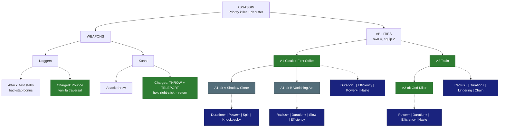

# Assassin - Priority killer

**Main role:** priority killer (burst on one target). **Second role:** debuffer. **Class skill:** Assassination. **Identity:** cloak,
teleport in, strike, teleport out. *Numbers are placeholders. Legend in [README.md](README.md).*

## Weapons

| Weapon | Attack | Charged attack / traversal | Status |
|---|---|---|---|
| Daggers | Vanilla fast stabs; vanilla backstab bonus from behind | Vanilla **Pounce** (a sweep / stab lunge) | LOCKED - vanilla for now (Skyy: change later; *idea:* Smoke Roll) |
| Kunai | Throw (vanilla has no charged kunai attack) | **THROW + TELEPORT**: hold to charge, throw, and you teleport to where it lands (up to ~20 blocks; if it flies out of range you appear where it left your range); **hold right-click to RETURN** to where you were before, with an AoE knockback (*default:* the return works for ~8 s) | LOCKED (Skyy 2026-10-04) |

## Abilities

### A1 - Cloak + First Strike (LOCKED)
| | |
|---|---|
| Does | Invisible for a limited time (breaks when you attack). **First Strike** is not tied to the cloak: even if the cloak runs out, your next hit gets **+100% crit chance** |
| Crit rule (all classes) | max crit chance becomes **150%**; above 100% = overcrit, above 200% = **triple crit**. At the cap: 50% overcrit chance; with First Strike 250% = a 50% chance of a triple crit (SkyyGear change) |
| Duration+ | longer cloak |
| Efficiency | cheaper |
| Power+ | more First Strike crit damage |
| Haste | move speed while cloaked |

### A1-alt A - Shadow Clone (*proposed*, pick A or B)
| | |
|---|---|
| Does | Cloak and leave a decoy that mobs attack for 5 s; when it ends the clone bursts for damage (engine check: can a mod pick a mob's target?) |
| Duration+ / Power+ | longer clone / more clone HP + burst |
| Split | 2 clones |
| Knockback+ | the burst pushes enemies away |

### A1-alt B - Vanishing Act (*proposed*, pick A or B)
| | |
|---|---|
| Does | An instant short cloak (3 s) + a 4-block smoke cloud: enemies inside lose track of you for 2 s and are slowed; First Strike as A1 |
| Radius+ / Duration+ | bigger / longer smoke |
| Slow | stronger slow in the smoke |
| Efficiency | cheaper |

### A2 - Toxin (LOCKED)
| | |
|---|---|
| Does | Throw a vial: a 4-block poison cloud for 5 s - Poisoned (damage over time) + Weakened (deal 15% less damage) |
| Radius+ / Duration+ | bigger / longer cloud |
| Lingering | the ground stays poisoned after the cloud |
| Chain | when a poisoned enemy dies the poison jumps to the nearest enemy |

### A2-alt - God Killer (LOCKED)
| | |
|---|---|
| Does | Your next attack on a **boss or mini-boss** does **2x** damage, **3x** if it is a backstab; stacks with First Strike |
| Power+ | bigger multiplier |
| Duration+ | the "next attack" window lasts longer |
| Efficiency | cheaper |
| Haste | speed boost after the strike to get away |

## Modifier pool - pick 4 for each ability (2 equipped)

| Modifier | What it does | Each level adds |
|---|---|---|
| Duration+ | lasts longer | more time |
| Radius+ | bigger area | more blocks |
| Power+ | stronger main effect (damage, heal, shield, buff) | more % |
| Efficiency | costs less Mana / Stamina | lower cost |
| Split | splits into 3 weaker copies (projectiles, lines) | stronger copies |
| Ricochet | PROJECTILES only: the shot flies on to the next enemy after a hit (walls block it, it can miss) | +1 bounce |
| Pierce | passes through enemies | +1 enemy |
| Chain | EFFECTS only (heals, buffs, debuffs, poison, hooks): jumps instantly to the next target in range - enemies, or allies for support | +1 jump |
| Lingering | leaves a zone behind (fire, poison, light) | longer zone |
| Slow | adds a slow | stronger slow |
| Knockback+ | pushes enemies away | farther |
| Pull | draws enemies in | stronger pull |
| Follow | a placed zone moves with you instead | bigger zone |
| Leech | heals you for part of the damage | more % |
| Ward | adds a small shield (you, or allies for support abilities) | bigger shield |
| Haste | attack + move speed for a few seconds after use | longer |
| Echo | repeats once after 1 s at reduced strength | stronger echo |

## Class tree paths (ideas - pick one)
- *Shadow* - cloak, First Strike, God Killer.
- *Venom* - poison stacks, spreading Toxin, Weaken.
- *Blink* - kunai range, return knockback, extra teleports.

## Open
- A1-alt pair (Shadow Clone / Vanishing Act proposed).

## Change log
- 2026-10-04: modifier pool table added under the abilities (Skyy).
- 2026-10-04: file created; daggers vanilla, kunai throw-teleport + return, Cloak + First Strike (crit cap 150%, triple crit), Toxin,
  God Killer - all LOCKED (Skyy).
