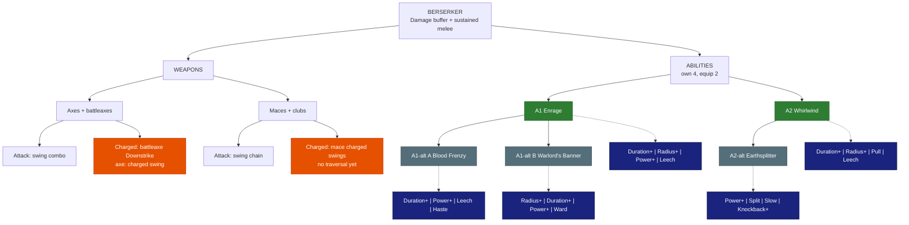

# 🪓 Berserker

| | |
|---|---|
| 🎯 **Main role** | Party damage buffer |
| 🎯 **Second role** | Sustained melee damage |
| 📈 **Class skill** | Fury |
| 💬 **In one line** | Rage that lifts the whole party. Heals itself by hitting. |

Numbers are placeholders. Labels: 🟢 Locked · 🔵 Proposed · 🟠 Open - see [README.md](README.md).

&nbsp;

## 🗺️ Map

&nbsp;

## ⚔️ Weapons

### Axes (incl. battleaxes)

🟠 **Open** - traversal

- **Attack:** vanilla swing combo.

- **Charged:** battleaxes use the vanilla **Downstrike** (a heavy charged slam). Axes: a charged swing with no movement.

- 🟠 **Open:** is the Downstrike enough of a traversal? Axes need one.

- 🔵 **Proposed traversal - Leap Slam** (for both): leap forward and smash down.

### Maces + clubs

🟠 **Open** - needs a traversal

- **Attack:** vanilla swing chain. Maces can charge each swing; plain clubs have no charged attack wired.

- **Charged:** mace charged swings, no movement.

- 🔵 **Proposed traversal - Bull Rush:** charge forward, knocking enemies aside.

&nbsp;

## ✨ Abilities

You own 4. You equip 2.

### A1 · Enrage

🟢 **Locked**

- **Does:** the party within 8 blocks gets a **damage buff that GROWS** for 10 s (+10% → +20%).

- It holds 5 s, then ends abruptly.

- The Berserker gets the same buff but bigger (+20% → +40%).

- **Levels:** +1% to the peak per level.

**Modifiers**

- ⏳ **Duration+** - longer hold.

- ⭕ **Radius+** - bigger party circle.

- 💪 **Power+** - higher peak.

- 🩸 **Leech** - you heal for part of your damage while enraged.

### A1-alt A · Blood Frenzy

🔵 **Proposed** - pick A or B

- **Does:** the rage grows with **every hit you land** instead of over time.

- +2% per hit for you, +1% for the party, up to 20 stacks.

- Ends 5 s after your last hit.

**Modifiers**

- ⏳ **Duration+** - longer grace before it ends.

- 💪 **Power+** - more per stack.

- 🩸 **Leech** - heal per hit.

- ⚡ **Haste** - attack speed while above 10 stacks.

### A1-alt B · Warlord's Banner

🔵 **Proposed** - pick A or B

- **Does:** plant a **war banner** for 15 s.

- The party within 8 blocks gets **+15% damage**. You get **+25%** while near it.

**Modifiers**

- ⭕ **Radius+** / ⏳ **Duration+** - bigger / longer.

- 💪 **Power+** - stronger buff.

- 🛡️ **Ward** - allies near the banner get a small shield.

### A2 · Whirlwind

🟢 **Locked**

- **Does:** **spin for 3 s**, hitting everything within 3 blocks every 0.5 s.

- Heals 10% of the damage.

**Modifiers**

- ⏳ **Duration+** / ⭕ **Radius+** - longer / wider spin.

- 🧲 **Pull** - enemies are drawn into the spin.

- 🩸 **Leech** - more healing.

### A2-alt · Earthsplitter

🔵 **Proposed**

- **Does:** slam a **shockwave line** 12 blocks forward that knocks enemies up 1 s.

- It hits harder the lower your Health (+1% per 1% missing).

**Modifiers**

- 💪 **Power+** - more damage.

- 🔱 **Split** - 3 lines in a fan.

- 🐌 **Slow** - enemies stay slowed after landing.

- 💥 **Knockback+** - knocks them farther.

&nbsp;

## 🧩 Modifier pool

Each ability offers 4 of these. You equip 2.

<!-- POOL START - tools/class_pages.py copies this block into every class file (python tools/class_pages.py --sync-pool) -->
- ⏳ **Duration+** - lasts longer · each level: more time.

- ⭕ **Radius+** - bigger area · each level: more blocks.

- 💪 **Power+** - stronger main effect (damage, heal, shield, buff) · each level: more %.

- 💧 **Efficiency** - costs less Mana / Stamina · each level: lower cost.

- 🔱 **Split** - splits into 3 weaker copies (projectiles, lines) · each level: stronger copies.

- 🎱 **Ricochet** - PROJECTILES only: the shot flies on to the next enemy after a hit (walls block it, it can miss) · each level: +1 bounce.

- 📌 **Pierce** - passes through enemies · each level: +1 enemy.

- ⛓️ **Chain** - EFFECTS only (heals, buffs, debuffs, poison, hooks): jumps instantly to the next target in range - enemies, or allies for support · each level: +1 jump.

- 🔥 **Lingering** - leaves a zone behind (fire, poison, light) · each level: longer zone.

- 🐌 **Slow** - adds a slow · each level: stronger slow.

- 💥 **Knockback+** - pushes enemies away · each level: farther.

- 🧲 **Pull** - draws enemies in · each level: stronger pull.

- 👣 **Follow** - a placed zone moves with you instead · each level: bigger zone.

- 🩸 **Leech** - heals you for part of the damage · each level: more %.

- 🛡️ **Ward** - adds a small shield (you, or allies for support abilities) · each level: bigger shield.

- ⚡ **Haste** - attack + move speed for a few seconds after use · each level: longer.

- 🔁 **Echo** - repeats once after 1 s at reduced strength · each level: stronger echo.
<!-- POOL END -->

&nbsp;

## 🌳 Class tree paths

Ideas - pick one.

- **Warbringer** - bigger Enrage for the party.

- **Bloodbound** - life steal and low-Health power.

- **Smasher** - stuns and knock-ups on heavy hits.

&nbsp;

## 🟠 Open

- Traversals for axes and maces / clubs (Leap Slam / Bull Rush proposed).

- A1-alt pair.

- A2-alt.

&nbsp;

## 📜 Change log

- 2026-10-05: refined for easy reading (same facts, new layout).

- 2026-10-04: modifier pool table added under the abilities (Skyy).

- 2026-10-04: file created; Enrage (growing party + bigger self buff) and Whirlwind LOCKED (Skyy).
