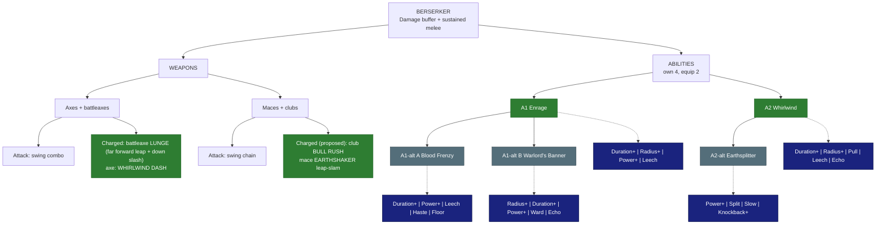

# 🪓 Berserker - Damage buffer

| | |
|---|---|
| 🎯 **Main role** | Party damage buffer |
| 🎯 **Second role** | Sustained melee damage |
| 📈 **Class skill** | Fury |
| 💬 **In one line** | Rage that lifts the whole party. Heals itself by hitting. |

Numbers are placeholders. Labels: 🟢 Locked · 🔵 Proposed · 🟠 Open - see [README.md](README.md).

&nbsp;

## 🗺️ Map

&nbsp;

## ⚔️ Weapons

### Axes (incl. battleaxes)

🟢 **Locked** - vanilla for now (Skyy 2026-10-05: custom traversals come later)

- **Attack:** vanilla swing combo.

- **Charged:** battleaxes use the vanilla **Downstrike** (a heavy charged slam). Axes: a charged swing with no movement.

- 🟢 **Axes - Lunge** (Skyy 2026-10-07: "for the axes do a lunge forward with a down slash. (lunge/far leap, goes more froward than up.)"): hold + release to leap far FORWARD (more forward than up) and land with a down slash. **Battleaxes get the Lunge** (Skyy 2026-10-07: "battleaxes get the lunge too, if you have a better idea for the normal axes, we would change that one instead.").
- 🟢 **Axes - Whirlwind Dash** (Skyy 2026-10-07: "yes, whirlwind dash for axes"): hold + release to spin forward along the ground (~6 blocks), slashing every enemy around you as you pass (the light axe = crowds; the battleaxe Lunge = one big hit).

### Maces + clubs

🟢 **Locked** - vanilla for now (Skyy 2026-10-05: custom traversals come later)

- **Attack:** vanilla swing chain. Maces can charge each swing; plain clubs have no charged attack wired.

- **Charged:** mace charged swings, no movement.

- 🔵 **Proposed (2026-10-07, one traversal per weapon):**
  - **Clubs - Bull Rush:** hold + release to charge forward along the ground, knocking enemies aside (the crude brute weapon; clubs have no charged attack today).
  - **Maces - Earthshaker:** hold + release to jump straight up (~4 blocks) and slam down; the shockwave knocks nearby enemies up and staggers them briefly (axes go forward, clubs go along the ground, maces go up).

&nbsp;

## ✨ Abilities

You own 4. You equip 2.

### A1 · Enrage

🟢 **Locked**

- **Does:** on activation, every **player within 8 blocks** and every **party member within 16 blocks** gets a **damage buff that GROWS** for 10 s (+10% → +20%).

- The range is checked **once, when you activate it** - the buff then stays on each player, it is **not an aura**: group up, activate, split up and attack (Skyy 2026-10-07).

- It holds 5 s, then ends abruptly.

- The Berserker gets the same buff but bigger (+20% → +40%).

- **Levels:** +1% to the peak per level.

**Modifiers**

- ⏳ **Duration+** - longer hold.

- ⭕ **Radius+** - bigger activation circles (both the 8-block player and the 16-block party range).

- 💪 **Power+** - higher peak.

- 🩸 **Leech** - you heal for part of your damage while enraged.

### A1-alt A · Blood Frenzy

🔵 **Proposed** - pick A or B

- **Does:** a **toggle** - while it is on, the rage grows with **every hit you land**: per stack you get **+1.5% damage, +1% attack speed and +0.5% move speed**, allies **half of each** (Skyy 2026-10-07: a bit less damage than Enrage, plus attack speed and a small move speed buff - "fits the name"), up to **25 stacks** (you +37.5% damage / +25% attack speed / +12.5% move speed - Enrage peaks at +40% damage; vs the Monk's Flowing Form at full stacks: more damage (it has none), less attack speed (it has +30%) - Skyy 2026-10-07); allies get it through an **AoE aura**: players within 8 blocks and party members within 16 blocks of you (the Enrage ranges) are buffed **only while they are inside it** (unlike Enrage, which is picked once) - so it works as a late-game passive; **each stack decays 6 s after it was gained** (Skyy 2026-10-07).

- **Cost:** **Mana + Stamina per ATTACK** (every swing, hit or miss; default 0.7 Mana + 0.6 Stamina) and only a **small drain over time** (0.15 Mana + 0.1 Stamina per second; 2026-10-08); Mana / Stamina still regenerate while it is on, so a high-level Berserker can leave it on as a passive buff. It switches off when either runs out (or when you toggle it off).

**Modifiers**

- ⏳ **Duration+** - stacks decay slower.

- 🧱 **Floor** - a minimum stack: you still start at 0, but once you pass 5 (level 1) or 10 (level 2) your stacks never decay below it · **cannot be paired with Duration+**.

- 💪 **Power+** - more per stack.

- 🩸 **Leech** - heal per hit.

- ⚡ **Haste** - attack speed while above 10 stacks.

### A1-alt B · Warlord's Banner

🔵 **Proposed** - pick A or B

- **Does:** plant a **war banner** for **30 s** with a **12-block** range (Skyy 2026-10-07).

- While in range: players **+8% damage, defence and attack speed**, party members **+12%** of each, you **+16%** of each (attack speed added by Skyy 2026-10-07; same numbers by default).

- **Cost:** a **big cost to plant it** (default **9 Mana + 8 Stamina** since 2026-10-08 - the 40 Mana split 23 / 77 for the Berserker; Skyy to confirm), nothing while it stands - Mana regenerates normally while it is up.

- **The banner falls** when its time runs out **or as soon as you leave its range** (Skyy 2026-10-07).

- **Every mob killed inside the banner's range extends it** (default +1 s per kill, mini-boss +3 s, boss +5 s; capped at 60 s total - Server Setup rows; Skyy 2026-10-07).

- The trade-off: less damage than Enrage / Blood Frenzy, but defence too - and it swaps mobility (you must stay near it) for a long duration.

**Modifiers**

- ⭕ **Radius+** / ⏳ **Duration+** - bigger / longer.

- 💪 **Power+** - stronger buff.

- 🛡️ **Ward** - allies near the banner get a small shield.

- 🔁 **Echo** - when the banner ends, its buff lingers on everyone who was in range for a few seconds at reduced strength · each level: stronger echo.

### A2 · Whirlwind

🟢 **Locked**

- **Does:** **spin for 3 s**, hitting everything within 3 blocks every 0.5 s.

- Heals 10% of the damage.

**Modifiers**

- ⏳ **Duration+** / ⭕ **Radius+** - longer / wider spin.

- 🧲 **Pull** - enemies are drawn into the spin.

- 🩸 **Leech** - more healing.

- 🔁 **Echo** - when the spin ends, a weaker spin repeats once 1 s later · each level: stronger echo.

### A2-alt · Earthsplitter

🔵 **Proposed**

- **Does:** slam a **shockwave line** 12 blocks forward that knocks enemies up 1 s.

- It hits harder the lower your Health (+1% per 1% missing).

**Modifiers**

- 💪 **Power+** - more damage.

- 🔱 **Split** - 3 lines in a fan.

- 🐌 **Slow** - enemies stay slowed after landing.

- 💥 **Knockback+** - knocks them farther.

&nbsp;

## 🧩 Modifier pool

Each ability offers 4 of these. You equip 2.

<!-- POOL START - tools/class_pages.py copies this block into every class file (python tools/class_pages.py --sync-pool) -->
- ⏳ **Duration+** - lasts longer · each level: more time.

- ⭕ **Radius+** - bigger area · each level: more blocks.

- 💪 **Power+** - stronger main effect (damage, heal, shield, buff) · each level: more %.

- 💧 **Efficiency** - costs less Mana / Stamina · each level: lower cost.

- 🔱 **Split** - splits into 3 weaker copies (projectiles, lines) · each level: stronger copies.

- 🎱 **Ricochet** - PROJECTILES only: the shot flies on to the next enemy after a hit (walls block it, it can miss) · each level: +1 bounce.

- 📌 **Pierce** - passes through enemies · each level: +1 enemy.

- ⛓️ **Chain** - EFFECTS only (heals, buffs, debuffs, poison, hooks): jumps instantly to the next target in range - enemies, or allies for support · each level: +1 jump.

- 🔥 **Lingering** - leaves a zone behind (fire, poison, light) · each level: longer zone.

- 🐌 **Slow** - adds a slow · each level: stronger slow.

- 💥 **Knockback+** - pushes enemies away · each level: farther.

- 🧲 **Pull** - draws enemies in · each level: stronger pull.

- 👣 **Follow** - a placed zone moves with you instead · each level: bigger zone.

- 🩸 **Leech** - heals you for part of the damage · each level: more %.

- 🛡️ **Ward** - adds a small shield (you, or allies for support abilities) · each level: bigger shield.

- ⚡ **Haste** - attack + move speed for a few seconds after use · each level: longer.

- 🔁 **Echo** - repeats once after 1 s at reduced strength · each level: stronger echo.
<!-- POOL END -->

&nbsp;

## 🌳 Class tree paths

Ideas - pick one.

- **Warbringer** - bigger Enrage for the party.

- **Bloodbound** - life steal and low-Health power.

- **Smasher** - stuns and knock-ups on heavy hits.

&nbsp;

## 🟠 Open

- A1-alt pair.

- A2-alt.

&nbsp;

## 📜 Change log

- 2026-10-08 Skyy: melee Mana costs dropped, Stamina costs added (every class now has its own Mana / Stamina split; Berserker split 20 / 80 (costs 23 / 77)): Enrage 3 Mana + 3 Stamina (was 14 Mana), Whirlwind 3 Mana + 2 Stamina (was 12 Mana), Earthsplitter 3 Mana + 3 Stamina (was 14 Mana), Warlord's Banner 9 Mana + 8 Stamina (was 40 Mana); Blood Frenzy 0.7 Mana + 0.6 Stamina per swing and 0.15 + 0.1 per second (was 1 + 0.5 and 0.2 + 0.1) - full table in research/cloud/Class-Ability-Spec-Draft.md section 2; pools and the why per class in research/Class-Power-Split.md.

- 2026-10-07: Whirlwind gains Echo (Skyy).

- 2026-10-07: Warlord's Banner = 30 s, 12 blocks; +8% / +12% / +16% damage AND defence (players / party / you); Echo modifier (Skyy).

- 2026-10-07: Blood Frenzy buffs allies through an aura (players 8 / party 16, only while inside); new Floor modifier (min stack 5 / 10, not with Duration+) (Skyy).

- 2026-10-07: Blood Frenzy = a toggle; max 25 stacks, 6 s decay per stack; Mana + Stamina per attack (hit or miss) + a small drain over time (Skyy).

- 2026-10-07: Enrage range = players within 8 + party within 16 at activation; the buff stays (not an aura) (Skyy).

- 2026-10-07: axe Lunge LOCKED (Skyy); one traversal per weapon - proposed Bull Rush for clubs, Earthshaker for maces.

- 2026-10-05: weapon traversals stay VANILLA FOR NOW (Skyy: "they stay vanilla FOR NOW. they will change later.") - the proposals are ideas for later.

- 2026-10-05: refined for easy reading (same facts, new layout).

- 2026-10-04: modifier pool table added under the abilities (Skyy).

- 2026-10-04: file created; Enrage (growing party + bigger self buff) and Whirlwind LOCKED (Skyy).
