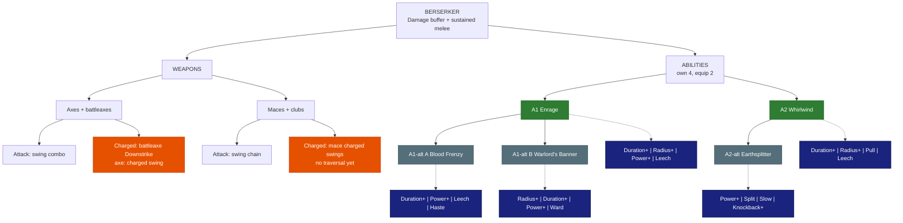

# Berserker - Damage buffer

**Main role:** party damage buffer. **Second role:** sustained melee damage. **Class skill:** Fury. **Identity:** rage that lifts the
whole party, heals itself by hitting. *Numbers are placeholders. Legend in [README.md](README.md).*

## Weapons

| Weapon | Attack | Charged attack / traversal | Status |
|---|---|---|---|
| Axes (incl. battleaxes) | Vanilla swing combo | Battleaxes: vanilla **Downstrike** (a heavy charged slam). Axes: a charged swing with no movement | **OPEN**: is the Downstrike enough of a traversal? Axes need one - *proposed:* **Leap Slam** (leap forward and smash down) for both |
| Maces + clubs | Vanilla swing chain (maces can charge each swing; plain clubs have no charged attack wired) | Mace charged swings, no movement | **OPEN**: needs a traversal. *Proposed:* **Bull Rush** - charge forward, knocking enemies aside |

## Abilities

### A1 - Enrage (LOCKED)
| | |
|---|---|
| Does | Party within 8 blocks gets a damage buff that GROWS for 10 s (+10% -> +20%), holds 5 s, then ends abruptly; the Berserker gets the same buff but bigger (+20% -> +40%) |
| Levels | +1% to the peak per level |
| Duration+ | longer hold |
| Radius+ | bigger party circle |
| Power+ | higher peak |
| Leech | you heal for part of your damage while enraged |

### A1-alt A - Blood Frenzy (*proposed*, pick A or B)
| | |
|---|---|
| Does | The rage grows with every hit you land instead of over time (+2% per hit for you, +1% for the party, up to 20 stacks); ends 5 s after your last hit |
| Duration+ | longer grace before it ends |
| Power+ | more per stack |
| Leech | heal per hit |
| Haste | attack speed while above 10 stacks |

### A1-alt B - Warlord's Banner (*proposed*, pick A or B)
| | |
|---|---|
| Does | Plant a war banner for 15 s: the party within 8 blocks gets +15% damage; you get +25% while near it |
| Radius+ / Duration+ | bigger / longer |
| Power+ | stronger buff |
| Ward | allies near the banner get a small shield |

### A2 - Whirlwind (LOCKED)
| | |
|---|---|
| Does | Spin for 3 s hitting everything within 3 blocks every 0.5 s, healing 10% of the damage |
| Duration+ / Radius+ | longer / wider spin |
| Pull | enemies are drawn into the spin |
| Leech | more healing |

### A2-alt - Earthsplitter (*proposed*)
| | |
|---|---|
| Does | Slam a shockwave line 12 blocks forward that knocks enemies up 1 s; it hits harder the lower your Health (+1% per 1% missing) |
| Power+ | more damage |
| Split | 3 lines in a fan |
| Slow | enemies stay slowed after landing |
| Knockback+ | knocks them farther |

## Modifier pool - pick 4 for each ability (2 equipped)

| Modifier | What it does | Each level adds |
|---|---|---|
| Duration+ | lasts longer | more time |
| Radius+ | bigger area | more blocks |
| Power+ | stronger main effect (damage, heal, shield, buff) | more % |
| Efficiency | costs less Mana / Stamina | lower cost |
| Split | splits into 3 weaker copies (projectiles, lines) | stronger copies |
| Ricochet | PROJECTILES only: the shot flies on to the next enemy after a hit (walls block it, it can miss) | +1 bounce |
| Pierce | passes through enemies | +1 enemy |
| Chain | EFFECTS only (heals, buffs, debuffs, poison, hooks): jumps instantly to the next target in range - enemies, or allies for support | +1 jump |
| Lingering | leaves a zone behind (fire, poison, light) | longer zone |
| Slow | adds a slow | stronger slow |
| Knockback+ | pushes enemies away | farther |
| Pull | draws enemies in | stronger pull |
| Follow | a placed zone moves with you instead | bigger zone |
| Leech | heals you for part of the damage | more % |
| Ward | adds a small shield (you, or allies for support abilities) | bigger shield |
| Haste | attack + move speed for a few seconds after use | longer |
| Echo | repeats once after 1 s at reduced strength | stronger echo |

## Class tree paths (ideas - pick one)
- *Warbringer* - bigger Enrage for the party.
- *Bloodbound* - life steal and low-Health power.
- *Smasher* - stuns and knock-ups on heavy hits.

## Open
- Traversals for axes and maces / clubs (Leap Slam / Bull Rush proposed); A1-alt pair; A2-alt.

## Change log
- 2026-10-04: modifier pool table added under the abilities (Skyy).
- 2026-10-04: file created; Enrage (growing party + bigger self buff) and Whirlwind LOCKED (Skyy).
