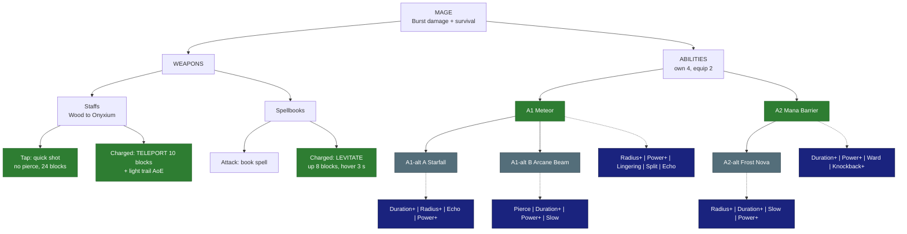

# 🔮 Mage - Burst damage (glass cannon)

| | |
|---|---|
| 🎯 **Main role** | Burst damage |
| 🎯 **Second role** | Survival |
| 📈 **Class skill** | Sorcery |
| 💬 **In one line** | Magic glass cannon (Skyy). |

- More damage per Mana than the Priest.

- Range + mobility. Low health and defence.

- Max Mana +10 per Sorcery level.

Numbers are placeholders. Labels: 🟢 Locked · 🔵 Proposed · 🟠 Open - see [README.md](README.md).

&nbsp;

## 🗺️ Map

&nbsp;

## ⚔️ Weapons

### Staffs (Wood → Onyxium, SkyyArmory)

🟢 **Locked** (Skyy 2026-10-04)

- **Tap = quick shot:** no pierce, ~24 blocks range, 1/5 Mana. A little more damage per Mana than the Priest's wand.

- **Charged = TELEPORT** the way you look (up too).

  - 10 blocks to start, upgradable in the tree. You can set a shorter custom distance there.

  - Leaves a **trail of light** along the path that hurts enemies in it for a few seconds (default: 1.5 blocks wide, 3 s, ~30% of the charged damage per second).

  - Never into blocks or out over open void.

  - No Stamina cost.

- 💡 **Idea for later (Skyy) - not decided yet:** special staffs whose quick shots pierce.

### Spellbooks

🟢 **Locked** (Skyy 2026-10-04)

- **Attack:** the book's spell.

- **Charged = LEVITATE:** float up ~8 blocks, hover ~3 s drifting the way you look, land with no fall damage.

&nbsp;

## ✨ Abilities

You own 4. You equip 2.

### A1 · Meteor

🟢 **Locked**

- **Does:** pick a spot up to 25 blocks away.

- After 1 s a meteor hits a **4-block area** for **~3x** a charged staff shot.

- **Levels:** +2% damage per level.

**Modifiers**

- ⭕ **Radius+** - bigger blast.

- 💪 **Power+** - more damage.

- 🔥 **Lingering** - the ground keeps burning for 3 s.

- 🔱 **Split** - 3 smaller meteors around the spot.

- 🔁 **Echo** - a second, weaker meteor hits the same spot 1 s later · each level: stronger echo.

### A1-alt A · Starfall

🔵 **Proposed** - pick A or B

- **Does:** for 3 s, **12 stars** fall over a 6-block area (each ~40% of a Meteor).

- More total damage, spread out.

**Modifiers**

- ⏳ **Duration+** / ⭕ **Radius+** - more stars / bigger area.

- 🔁 **Echo** - a second, weaker shower right after.

- 💪 **Power+** - stronger stars.

### A1-alt B · Arcane Beam

🔵 **Proposed** - pick A or B

- **Does:** channel a **20-block beam** for up to 3 s.

- Its damage ramps from 1x to 3x per second. Huge single-target burst.

**Modifiers**

- 📌 **Pierce** - the beam hits +1 enemy behind the first per level.

- ⏳ **Duration+** - channel longer.

- 💪 **Power+** - faster ramp.

- 🐌 **Slow** - enemies in the beam are slowed.

### A2 · Mana Barrier

🟢 **Locked**

- **Does:** for **12 s** (at least - Skyy 2026-10-07), damage you take **drains Mana instead of Health** (1 Mana per 2 HP).

- It ends early if your Mana runs out.

**Modifiers**

- ⏳ **Duration+** - lasts longer.

- 💪 **Power+** - better ratio (more HP per Mana).

- 🛡️ **Ward** - allies within 4 blocks also get a small shield.

- 💥 **Knockback+** - the barrier bursts when it ends, pushing enemies away.

### A2-alt · Frost Nova

🔵 **Proposed**

- **Does:** **freeze** enemies within 5 blocks for 2 s (a hit breaks it after 1 s).

- Then **Chill** them for 3 s. Escape by control.

**Modifiers**

- ⭕ **Radius+** / ⏳ **Duration+** - bigger / longer freeze.

- 🐌 **Slow** - stronger Chill.

- 💪 **Power+** - damage on freeze + break.

&nbsp;

## 🧩 Modifier pool

Each ability offers 4 of these. You equip 2.

<!-- POOL START - tools/class_pages.py copies this block into every class file (python tools/class_pages.py --sync-pool) -->
- ⏳ **Duration+** - lasts longer · each level: more time.

- ⭕ **Radius+** - bigger area · each level: more blocks.

- 💪 **Power+** - stronger main effect (damage, heal, shield, buff) · each level: more %.

- 💧 **Efficiency** - costs less Mana / Stamina · each level: lower cost.

- 🔱 **Split** - splits into 3 weaker copies (projectiles, lines) · each level: stronger copies.

- 🎱 **Ricochet** - PROJECTILES only: the shot flies on to the next enemy after a hit (walls block it, it can miss) · each level: +1 bounce.

- 📌 **Pierce** - passes through enemies · each level: +1 enemy.

- ⛓️ **Chain** - EFFECTS only (heals, buffs, debuffs, poison, hooks): jumps instantly to the next target in range - enemies, or allies for support · each level: +1 jump.

- 🔥 **Lingering** - leaves a zone behind (fire, poison, light) · each level: longer zone.

- 🐌 **Slow** - adds a slow · each level: stronger slow.

- 💥 **Knockback+** - pushes enemies away · each level: farther.

- 🧲 **Pull** - draws enemies in · each level: stronger pull.

- 👣 **Follow** - a placed zone moves with you instead · each level: bigger zone.

- 🩸 **Leech** - heals you for part of the damage · each level: more %.

- 🛡️ **Ward** - adds a small shield (you, or allies for support abilities) · each level: bigger shield.

- ⚡ **Haste** - attack + move speed for a few seconds after use · each level: longer.

- 🔁 **Echo** - repeats once after 1 s at reduced strength · each level: stronger echo.
<!-- POOL END -->

&nbsp;

## 🌳 Class tree paths

Ideas - pick one. The Mage tree already has three lanes.

- **Riftwalker** - teleport upgrades (distance, trail damage), mobility.

- **Light Bender** - light / radiant damage, trail and Starfall effects.

- **Arcanist** - raw Mana power, Barrier and Beam.

&nbsp;

## 🟠 Open

- Mage A2-alt (Frost Nova proposed).

- A1-alt pair.

&nbsp;

## 📜 Change log

- 2026-10-07: Mana Barrier lasts at least 12 s (was 6 s), still drains Mana instead of Health (Skyy: "mana barier should last at least 12 seconds keep the mana drain instead of hp").

- 2026-10-07: Echo modifier added to Meteor too (Skyy: "the modifier, echo.  that should be available on the metro too.").

- 2026-10-05: refined for easy reading (same facts, new layout).

- 2026-10-04: modifier pool table added under the abilities (Skyy).

- 2026-10-04: file created; staff Teleport + trail, spellbook Levitate, quick-shot range, Meteor + Mana Barrier LOCKED (Skyy).
