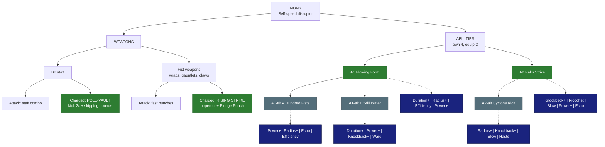

# 🥋 Monk - Self-speed disruptor

| | |
|---|---|
| 🎯 **Main role** | Disruptor (speed + combos) |
| 🎯 **Second role** | Single-target control |
| 📈 **Class skill** | 🟠 OPEN (a new class skill) |
| 💬 **In one line** | Graceful, fast, skips across the battlefield. |

- Replaces the unplayable Shaman slot (Skyy: our own classes, not Wynncraft's).

- Later class idea: a Martial Artist with kicks + fists.

Numbers are placeholders. Labels: 🟢 Locked · 🔵 Proposed · 🟠 Open - see [README.md](README.md).

&nbsp;

## 🗺️ Map

&nbsp;

## ⚔️ Weapons

### Bo staff (vanilla Bamboo / Wood Bo staffs, metal tiers later)

🟢 **Locked** (Skyy 2026-10-04)

- **Attack:** staff combo.

- **Charged = POLE-VAULT:** lunge forward and vault up and forward. It kicks any enemy in the way for **2x** a normal hit (only the vault kicks).

- **Flowing fall:** 15% slower, 15% less fall damage.

- **1 free mid-air jump** if it is your first jump after the vault.

- **Skipping bounds:** jump right as you land to bound forward - a bit higher than a normal jump, much farther, still slow-falling.

  - Chain them as long as your timing holds.

  - A timed landing takes **no fall damage**, and the **farther you fell, the farther you bound**.

  - Bounds do no damage but cost more Stamina than a jump.

### Fist weapons (cloth hand wraps, gauntlets, claws - one traversal)

🟢 **Locked** (Skyy 2026-10-04)

- **Attack** (Skyy 2026-10-07, lighter = faster; wraps + gauntlets hit ONE enemy, claws hit several):
  - **Hand wraps:** several jabs per click, a power hit on the Nth jab, no gap after it (fast enough to stunlock one enemy; bosses + mini-bosses break out by hitting you after 3 s of stunlock, 3 s more per extra player stunlocking them - 2 players = 6 s - Skyy 2026-10-07) - T1 Linen + T2 Cotton: 2 jabs per click, power hit on jab 6 · T3 Silk: 2 per click, power on 4 · T4 Cindercloth: 3 per click, power on 6 · T5 Shadoweave: 5 per click, power on the 5th.
  - **Gauntlets** (the Monk's heavy weapon): 1 jab per click, a chain of 4 with a harder finisher; more damage per hit; speed a little faster than a vanilla sword, a little slower than a vanilla dagger; after the finisher there is always a gap long enough for most mobs to hit back.
  - **Claws** (later): a little faster than gauntlets, 1 click = 1 slash, fast chained slashes, no power hit, hits several enemies (less DPS); higher tiers = more damage + a wider (and slightly longer) slash.

- **Charged = RISING STRIKE:** an uppercut leap (~6 blocks up, a little forward) that knocks enemies in front up with you.

- **Hang time** at the top slows you and them.

- Hits on airborne enemies send them **flying**.

- **Crouch near the top = PLUNGE PUNCH:** slam down, dragging the knocked-up enemies with you. The slam takes no fall damage but gives no Acrobatics XP.

- No plunge = a 15%-slower steerable fall (15% less fall damage).

&nbsp;

## ✨ Abilities

You own 4. You equip 2.

### A1 · Flowing Form

🟢 **Locked**

- **Does:** while active, enemies in an aura around you are **Awed**.

- Only YOU gain flat **move speed + attack speed**.

- Every hit you land = 1 combo. Each combo slows Awed enemies and lowers their defence.

- At **15 combo your flat buff doubles**.

- Drains **Mana AND Stamina** over time. Lasts 30 s (upgradable). Ends early when either runs out.

- Enemies stay Awed 10 s after it ends or after they leave the aura.

**Modifiers**

- ⏳ **Duration+** - longer (beyond 30 s).

- ⭕ **Radius+** - bigger aura.

- 💧 **Efficiency** - slower Mana / Stamina drain.

- 💪 **Power+** - bigger flat buff / stronger Awe per combo.

### A1-alt A · Hundred Fists

🔵 **Proposed** - pick A or B

- **Does:** Flowing Form where every **10 combo** also releases a **shockwave** on all Awed enemies (one weapon hit each).

**Modifiers**

- 💪 **Power+** / ⭕ **Radius+** - stronger / wider shockwave.

- 🔁 **Echo** - each shockwave repeats once, weaker.

- 💧 **Efficiency** - slower drain.

### A1-alt B · Still Water

🔵 **Proposed** - pick A or B

- **Does:** a calm stance for 10 s.

- You **deflect projectiles** from the front and **counter melee hits** (each blocked hit strikes back for one weapon hit).

- Every counter adds Awe.

**Modifiers**

- ⏳ **Duration+** / 💪 **Power+** - longer stance / stronger counters.

- 💥 **Knockback+** - countered enemies are pushed away.

- 🛡️ **Ward** - a small shield while in the stance.

### A2 · Palm Strike

🟢 **Locked**

- **Does:** a quick single-target strike: **stun ~0.75 s + knockback**.

- Low cost (~8 Mana), short cooldown - spammable at higher levels.

**Modifiers**

- 💥 **Knockback+** - farther knockback.

- 🎱 **Ricochet** - the struck enemy is launched into others and stuns them too.

- 🐌 **Slow** - the target stays slowed.

- 💪 **Power+** - longer stun / more damage.

- 🔁 **Echo** - a second, weaker palm strike hits the same target 1 s later · each level: stronger echo.

### A2-alt · Cyclone Kick

🔵 **Proposed**

- **Does:** a quick **spinning kick** that hits everything within 3 blocks and pushes it 5 blocks out (cheap).

**Modifiers**

- ⭕ **Radius+** / 💥 **Knockback+** - wider / farther.

- 🐌 **Slow** - kicked enemies are slowed.

- ⚡ **Haste** - speed boost after the kick.

&nbsp;

## 🧩 Modifier pool

Each ability offers 4 of these. You equip 2.

<!-- POOL START - tools/class_pages.py copies this block into every class file (python tools/class_pages.py --sync-pool) -->
- ⏳ **Duration+** - lasts longer · each level: more time.

- ⭕ **Radius+** - bigger area · each level: more blocks.

- 💪 **Power+** - stronger main effect (damage, heal, shield, buff) · each level: more %.

- 💧 **Efficiency** - costs less Mana / Stamina · each level: lower cost.

- 🔱 **Split** - splits into 3 weaker copies (projectiles, lines) · each level: stronger copies.

- 🎱 **Ricochet** - PROJECTILES only: the shot flies on to the next enemy after a hit (walls block it, it can miss) · each level: +1 bounce.

- 📌 **Pierce** - passes through enemies · each level: +1 enemy.

- ⛓️ **Chain** - EFFECTS only (heals, buffs, debuffs, poison, hooks): jumps instantly to the next target in range - enemies, or allies for support · each level: +1 jump.

- 🔥 **Lingering** - leaves a zone behind (fire, poison, light) · each level: longer zone.

- 🐌 **Slow** - adds a slow · each level: stronger slow.

- 💥 **Knockback+** - pushes enemies away · each level: farther.

- 🧲 **Pull** - draws enemies in · each level: stronger pull.

- 👣 **Follow** - a placed zone moves with you instead · each level: bigger zone.

- 🩸 **Leech** - heals you for part of the damage · each level: more %.

- 🛡️ **Ward** - adds a small shield (you, or allies for support abilities) · each level: bigger shield.

- ⚡ **Haste** - attack + move speed for a few seconds after use · each level: longer.

- 🔁 **Echo** - repeats once after 1 s at reduced strength · each level: stronger echo.
<!-- POOL END -->

&nbsp;

## 🌳 Class tree paths

Ideas - pick one.

- **Wind Dancer** - skipping, vaults and air combos.

- **Iron Fist** - fist damage, Plunge Punch, Palm Strike stuns.

- **Serene** - Still Water / Awe defence and control.

&nbsp;

## 🟠 Open

- The Monk's class skill name.

- A1-alt pair.

- A2-alt.

- Engine checks: glide / slow fall, timed landing jump, mid-air jump, dragging mobs in the air, knockback on airborne mobs.

&nbsp;

## 📜 Change log

- 2026-10-05: refined for easy reading (same facts, new layout).

- 2026-10-04: modifier pool table added under the abilities (Skyy).

- 2026-10-07: Palm Strike gains Echo (Skyy: "give monks palm strike echo too"); fist attacks, stunlock breakout, gauntlet speed (Skyy).

- 2026-10-04: file created; Bo staff pole-vault + skipping bounds, fist Rising Strike + Plunge Punch, Flowing Form (Awe combo), Palm Strike - all LOCKED (Skyy).
