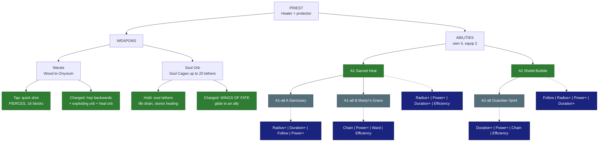

# Priest - Healer

**Main role:** healer. **Second role:** protector. **Class skill:** Divinity. **Identity (Skyy):** trades damage for healing. Max Mana +5
per Divinity level. Today's heal-on-hit (a share of the damage dealt) STAYS until all Priest abilities exist. *Numbers are placeholders.
Legend in [README.md](README.md).*

## Weapons

| Weapon | Attack | Charged attack / traversal | Status |
|---|---|---|---|
| Wands (Wood -> Onyxium, SkyyArmory) | **Tap = quick shot** that **pierces** (hits every enemy in a line), ~16 blocks, vanishes on blocks | **Hop BACKWARDS** (opposite to where you look - look down = straight up; shorter hop when there is no ground behind you) and fire an **exploding orb** (AoE ~6 blocks) that leaves a **healing orb** (~9 blocks, 3-4 s): allies inside heal **20% of the explosion's damage every second** | LOCKED (Skyy 2026-10-04) |
| Soul Orb (new weapon) | **Hold right-click = soul tethers**: a line of light locks onto the enemy you look at (you can then look away); steady damage for a steady Mana drain; **no Mana regen while active**; damage is **stored as bonus healing** for its ability (cap by tier); it tethers EVERY enemy in a small radius around where you look (up to the tier's tether cap) - see "How soul tethers work" below | **WINGS OF FATE**: long fast gliding bounds the way you look; if an ally is that way it locks on and carries you to them (farther than without); glowing blue wings + trail (looks only; tree perks later could slow / stun); arriving heals the ally (a base heal even with nothing stored, plus all the stored soul healing on top) | LOCKED (Skyy 2026-10-04) |

Later (Skyy): a special wand whose shots pass through blocks.

### Soul Orb ladder (each made from the one before; soul, gems and tethers take the essence colour)
| Tier | Made from | Colour | Tethers | Damage per Mana |
|---|---|---|---|---|
| Soul Orb | - | blue | 1 | 1.0x |
| Copper Soul Cage | Soul Orb + copper + Life Essence | green | 2 | 1.1x |
| Iron Soul Cage | Copper Cage + iron + Fire Essence (deep-cave mobs) | red | 4 | 1.1x |
| Thorium Soul Cage | Iron Cage + thorium + essence (**OPEN**) | ? | 6 | 1.5x |
| Cobalt Soul Cage | Thorium Cage + cobalt + essence (**OPEN**) | ? | 10 | 1.5x |
| Adamantite (*proposed*) | ... | ? | 14 | 2.0x |
| Mithril (*proposed*) | ... | ? | 16 | 2.0x |
| Onyxium (*proposed*) | ... | ? | 20 (a gem on each dodecahedron point) | 2.5x |

Mana per second per tether stays about the same up the ladder (a few small steps).

### How soul tethers work (LOCKED, Skyy 2026-10-04)
1. **Hold right-click** and look at enemies: every enemy in a **small radius around where you look** gets a tether at once
   (6 mobs packed in a 3-block space = 6 tethers in one go), up to your orb's tether cap.
2. **Damage starts immediately**, but the tether must **stabilize** first: keep looking at them for **1.5-2.5 s** (base orb; higher
   tiers stabilize faster). A new tether looks **wispy** and turns **solid** once stable.
3. **Once stable you can look away** - the tether holds while you keep holding right-click (or until your Mana runs out) - so you can
   look at the **next group** and tether them too, until you reach the cap.
4. Steady damage for a steady Mana drain per tether; damage is stored as bonus healing.
5. **No natural Mana regen while any tether is active - but MANA STEAL still works** (tether damage counts for it). With enough Mana
   Steal you can tether forever on the lower tiers. **Balance target:** max Mana Steal from gear = the Mana drain of a full
   **Cobalt Soul Cage** (10 tethers); the Adamantite+ cages drain more than max Mana Steal, so they cannot run forever.

## Abilities

### A1 - Sacred Heal (LOCKED)
| | |
|---|---|
| Does | Instant heal for everyone within 9 blocks (radius upgrades in the tree); the Priest heals 20% more; everyone inside also gets a short heal-over-time worth a % of the instant heal (the instant heal, the % and the duration upgrade separately) |
| Class tree | **Cleanse** (removes debuffs) is a class-tree upgrade of this ability (Skyy) |
| Radius+ | bigger heal circle |
| Power+ | bigger instant heal |
| Duration+ | longer heal-over-time |
| Efficiency | cheaper |

### A1-alt A - Sanctuary (*proposed*, pick A or B)
| | |
|---|---|
| Does | A holy zone for 8 s (7 blocks): allies inside heal 4% max Health per second and take 10% less damage |
| Radius+ / Duration+ | bigger / longer zone |
| Follow | the zone moves with you |
| Power+ | stronger heal |

### A1-alt B - Martyr's Grace (*proposed*, pick A or B)
| | |
|---|---|
| Does | A big instant heal on the lowest-health ally within 15 blocks that chains to 2 more allies (each 25% less) |
| Chain | +1 ally per level |
| Power+ | bigger heal |
| Ward | overhealing becomes a shield |
| Efficiency | cheaper |

### A2 - Shield Bubble (LOCKED)
| | |
|---|---|
| Does | Place a bubble (5 blocks) for 8 s that blocks projectiles and absorbs damage for allies inside; it has HP and can break |
| Follow | **LOCKED**: the bubble moves with you instead of staying put (a modifier, not a class-tree node) |
| Radius+ | bigger bubble |
| Power+ | more bubble HP |
| Duration+ | lasts longer |
| Class tree (example path) | the bubble damages enemies that touch or hit it -> then pick 1 of 5 elements for that damage |

### A2-alt - Guardian Spirit (*proposed*; Cleanse moved to the tree, so this slot needs a new ability)
| | |
|---|---|
| Does | Mark an ally within 20 blocks for 10 s: if they would die, they survive at 30% Health instead (once) |
| Duration+ | longer mark |
| Power+ | more Health on the save |
| Chain | marks +1 more ally |
| Efficiency | cheaper |

## Modifier pool - pick 4 for each ability (2 equipped)

| Modifier | What it does | Each level adds |
|---|---|---|
| Duration+ | lasts longer | more time |
| Radius+ | bigger area | more blocks |
| Power+ | stronger main effect (damage, heal, shield, buff) | more % |
| Efficiency | costs less Mana / Stamina | lower cost |
| Split | splits into 3 weaker copies (projectiles, lines) | stronger copies |
| Ricochet | PROJECTILES only: the shot flies on to the next enemy after a hit (walls block it, it can miss) | +1 bounce |
| Pierce | passes through enemies | +1 enemy |
| Chain | EFFECTS only (heals, buffs, debuffs, poison, hooks): jumps instantly to the next target in range - enemies, or allies for support | +1 jump |
| Lingering | leaves a zone behind (fire, poison, light) | longer zone |
| Slow | adds a slow | stronger slow |
| Knockback+ | pushes enemies away | farther |
| Pull | draws enemies in | stronger pull |
| Follow | a placed zone moves with you instead | bigger zone |
| Leech | heals you for part of the damage | more % |
| Ward | adds a small shield (you, or allies for support abilities) | bigger shield |
| Haste | attack + move speed for a few seconds after use | longer |
| Echo | repeats once after 1 s at reduced strength | stronger echo |

## Class tree paths (ideas - pick one)
- *Lightbringer* - big heals, Cleanse, heal-over-time.
- *Aegis* - shields: bubble damage + element, Guardian Spirit.
- *Soulweaver* - soul tethers, stored healing, Wings of Fate.

## Open
- Priest A2-alt (Guardian Spirit proposed); A1-alt pair; Soul Cage essences + colours for Thorium and up.

## Change log
- 2026-10-04: no Mana regen while tethering, but Mana Steal works; max Mana Steal = a full Cobalt cage's drain (Skyy).
- 2026-10-04: Wings of Fate always heals on arrival - a smaller base heal when no soul healing is stored (Skyy).
- 2026-10-04: soul tethers corrected - lock onto every enemy in a small radius where you look, stabilize in 1.5-2.5 s (faster at higher tiers), wispy -> solid, look away only once stable (Skyy).
- 2026-10-04: modifier pool table added under the abilities (Skyy).
- 2026-10-04: file created; wand hop + healing orb, Soul Orb + Wings of Fate + ladder, Sacred Heal, Shield Bubble (+ Follow modifier),
  Cleanse = class-tree upgrade - all LOCKED (Skyy).
