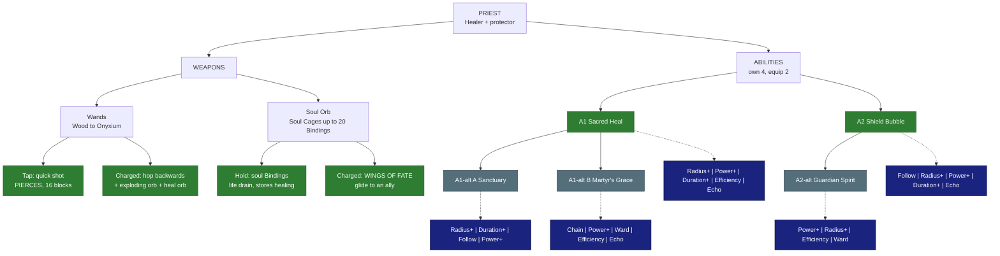

# ✨ Priest - Healer

| | |
|---|---|
| 🎯 **Main role** | Healer |
| 🎯 **Second role** | Protector |
| 📈 **Class skill** | Divinity |
| 💬 **In one line** | Trades damage for healing (Skyy). |

- Max Mana +5 per Divinity level.

- Today's heal-on-hit (a share of the damage dealt) STAYS until all Priest abilities exist.

Numbers are placeholders. Labels: 🟢 Locked · 🔵 Proposed · 🟠 Open - see [README.md](README.md).

&nbsp;

## 🗺️ Map

&nbsp;

## ⚔️ Weapons

### Wands (Wood → Onyxium, SkyyArmory)

🟢 **Locked** (Skyy 2026-10-04)

- **Tap = quick shot** that **pierces** (hits every enemy in a line). ~16 blocks. Vanishes on blocks.

- **Charged = hop BACKWARDS** (opposite to where you look).

  - Look down = straight up.

  - Full hop everywhere - no void protection (Skyy 2026-10-07); falling into the void is a race to get back out.

- The charged shot fires an **exploding orb** (AoE ~6 blocks).

- The explosion leaves a **healing orb** (~9 blocks, 3-4 s). Allies inside heal **20% of the explosion's damage every second**.

- 💡 **Idea for later (Skyy) - not decided yet:** a special wand whose shots pass through blocks.

### Soul Orb (new weapon)

🟢 **Locked** (Skyy 2026-10-04)

- **Hold right-click = soul Bindings.** A line of light locks onto the enemy you look at (you can then look away).

- Steady damage for a steady Mana drain. **No Mana regen while active.**

- Damage is **stored as bonus healing** for its ability (cap by tier).

- It binds EVERY enemy in a small radius around where you look (up to the tier's Binding cap) - see "How soul Bindings work" below.

- **Charged = WINGS OF FATE:**

  - Long, fast gliding bounds the way you look.

  - If an ally is that way, it locks on and carries you to them (farther than without).

  - Glowing blue wings + trail (looks only; tree perks later could slow / stun).

  - Arriving heals the ally: a base heal even with nothing stored, plus all the stored soul healing on top.

### 🔢 Soul Orb ladder

Each is made from the one before. The soul, gems and Bindings take the essence colour.

| Tier | Made from | Colour | Bindings | Damage per Mana |
|---|---|---|---|---|
| Soul Orb | - | 🔵 blue | 1 | 1.0x |
| Copper Soul Cage | Soul Orb + copper + Life Essence | 🟢 green | 2 | 1.1x |
| Iron Soul Cage | Copper Cage + iron + Fire Essence (deep-cave mobs) | 🔴 red | 4 | 1.1x |
| Thorium Soul Cage | Iron Cage + thorium + essence (🟠 **OPEN**) | ? | 6 | 1.5x |
| Cobalt Soul Cage | Thorium Cage + cobalt + essence (🟠 **OPEN**) | ? | 10 | 1.5x |
| Adamantite (🔵 proposed) | ... | ? | 14 | 2.0x |
| Mithril (🔵 proposed) | ... | ? | 16 | 2.0x |
| Onyxium (🔵 proposed) | ... | ? | 20 (a gem on each dodecahedron point) | 2.5x |

Mana per second per Binding stays about the same up the ladder (a few small steps).

### 🔗 How soul Bindings work

🟢 **Locked** (Skyy 2026-10-04)

1. **Hold right-click** and look at enemies. Every enemy in a **small radius around where you look** gets a Binding at once (6 mobs packed in a 3-block space = 6 Bindings in one go), up to your orb's Binding cap.

2. **Damage starts at once**, but the Binding must **stabilize** first. Keep looking at them for **1.5-2.5 s** (base orb; higher tiers stabilize faster). A new Binding looks **wispy** and turns **solid** once stable.

3. **Walls (Skyy 2026-10-07):** you cannot lock a Binding on THROUGH a block (you need line of sight to start it), but once locked it keeps draining even when the line passes through blocks.

4. **Once stable you can look away.** The Binding holds while you keep holding right-click (or until your Mana runs out). Look at the **next group** and bind them too, until you reach the cap.

5. Steady damage for a steady Mana drain per Binding. Damage is stored as bonus healing.

6. **No natural Mana regen while any Binding is active - but MANA STEAL still works** (Binding damage counts for it). With enough Mana Steal you can keep binding forever on the lower tiers.

   **Balance target:** max Mana Steal from gear = the Mana drain of a full **Cobalt Soul Cage** (10 Bindings). The Adamantite+ cages drain more than max Mana Steal, so they cannot run forever.

&nbsp;

## ✨ Abilities

You own 4. You equip 2.

### A1 · Sacred Heal

🟢 **Locked**

- **Does:** an **instant heal** for everyone within 9 blocks (radius upgrades in the tree).

- The Priest heals 20% more.

- Everyone inside also gets a short **heal-over-time** worth a % of the instant heal. The instant heal, the % and the duration upgrade separately.

- **Class tree:** **Cleanse** (removes debuffs) is a class-tree upgrade of this ability (Skyy).

**Modifiers**

- ⭕ **Radius+** - bigger heal circle.

- 💪 **Power+** - bigger instant heal.

- ⏳ **Duration+** - longer heal-over-time.

- 💧 **Efficiency** - cheaper.

- 🔁 **Echo** - a second, weaker instant heal pulses 1 s later in the same circle · each level: stronger echo.

### A1-alt A · Sanctuary

🔵 **Proposed** - pick A or B

- **Does:** a holy zone for **12 s**, starting at **8 blocks** (Skyy 2026-10-07).

- Allies inside heal **5% max Health per second** and take **10% less damage**.

**Modifiers**

- ⭕ **Radius+** / ⏳ **Duration+** - bigger / longer zone.

- 👣 **Follow** - the zone moves with you.

- 💪 **Power+** - stronger heal.

### A1-alt B · Martyr's Grace

🔵 **Proposed** - pick A or B

- **Does:** a big instant heal on the **lowest-health** target within **30 blocks**: **75% of max Health** (Skyy 2026-10-07).

- It **chains** to the next-lowest target, **15% less each jump** (75% → 60% → 45% → 30% → 15%), so it reaches up to 5 targets.

- **Order:** all **party members in range first** (lowest health first), and only **after every party member in range is healed** does it chain on to non-party players.

- **The Priest counts as a party member:** if you are the closest to death it heals you first and chains from you; if you are near full you are the last party member it reaches.

- Trades AoE for targeted heals at a much longer range.

**Modifiers**

- ⛓️ **Chain** - **+1 target per level AND a smaller drop per jump**, so big parties (and players outside the party) still get healed: max level = **10 targets** with a 7% drop (75% → 68% → 61% … → 12%) (Skyy 2026-10-07: "10 chain would be cool to see").

- 💪 **Power+** - bigger heal.

- 🛡️ **Ward** - overhealing becomes a shield.

- 💧 **Efficiency** - cheaper.

- 🔁 **Echo** - the whole chain repeats once 1 s later at reduced strength · each level: stronger echo.

### A2 · Shield Bubble

🟢 **Locked**

- **Does:** place a **bubble** (**6 blocks**) for **12 s** (Skyy 2026-10-07).

- It blocks projectiles and absorbs damage for allies inside. It has HP and can break.

- **Class tree (example path):** the bubble damages enemies that touch or hit it → then pick 1 of 5 elements for that damage.

**Modifiers**

- 👣 **Follow** - 🟢 **Locked:** the bubble moves with you instead of staying put (a modifier, not a class-tree node).

- ⭕ **Radius+** - bigger bubble.

- 💪 **Power+** - more bubble HP.

- ⏳ **Duration+** - lasts longer.

- 🔁 **Echo** - when the bubble ends or breaks, a weaker bubble forms once in the same place · each level: stronger echo.

### A2-alt · Guardian Spirit

🔵 **Proposed** - a **PASSIVE** (Skyy 2026-10-07)

- **Does:** when a **party member** (or a player you have **tagged**) would die within **30 blocks** of you - **or you would die** - they survive at **30% Health** instead, **if you have enough Mana** for it (the Mana is paid then; not enough Mana = no save).

- **Cooldown per player, doubling:** the first save of a player (say Jeff) puts Jeff on a 12 s cooldown, the next save 24 s, then 48 s, and so on; it **resets after a while out of combat** (default 30 s) - so you cannot keep one tank alive forever from the back.

**Modifiers**

- 💪 **Power+** - more Health on the save.

- ⭕ **Radius+** - longer save range.

- 💧 **Efficiency** - cheaper save.

- 🛡️ **Ward** - a saved player also gets a small shield.

&nbsp;

## 🧩 Modifier pool

Each ability offers 4 of these. You equip 2.

<!-- POOL START - tools/class_pages.py copies this block into every class file (python tools/class_pages.py --sync-pool) -->
- ⏳ **Duration+** - lasts longer · each level: more time.

- ⭕ **Radius+** - bigger area · each level: more blocks.

- 💪 **Power+** - stronger main effect (damage, heal, shield, buff) · each level: more %.

- 💧 **Efficiency** - costs less Mana / Stamina · each level: lower cost.

- 🔱 **Split** - splits into 3 weaker copies (projectiles, lines) · each level: stronger copies.

- 🎱 **Ricochet** - PROJECTILES only: the shot flies on to the next enemy after a hit (walls block it, it can miss) · each level: +1 bounce.

- 📌 **Pierce** - passes through enemies · each level: +1 enemy.

- ⛓️ **Chain** - EFFECTS only (heals, buffs, debuffs, poison, hooks): jumps instantly to the next target in range - enemies, or allies for support · each level: +1 jump.

- 🔥 **Lingering** - leaves a zone behind (fire, poison, light) · each level: longer zone.

- 🐌 **Slow** - adds a slow · each level: stronger slow.

- 💥 **Knockback+** - pushes enemies away · each level: farther.

- 🧲 **Pull** - draws enemies in · each level: stronger pull.

- 👣 **Follow** - a placed zone moves with you instead · each level: bigger zone.

- 🩸 **Leech** - heals you for part of the damage · each level: more %.

- 🛡️ **Ward** - adds a small shield (you, or allies for support abilities) · each level: bigger shield.

- ⚡ **Haste** - attack + move speed for a few seconds after use · each level: longer.

- 🔁 **Echo** - repeats once after 1 s at reduced strength · each level: stronger echo.
<!-- POOL END -->

&nbsp;

## 🌳 Class tree paths

Ideas - pick one.

- **Lightbringer** - big heals, Cleanse, heal-over-time.

- **Aegis** - shields: bubble damage + element, Guardian Spirit.

- **Soulweaver** - soul Bindings, stored healing, Wings of Fate.

&nbsp;

## 🟠 Open

- Priest A2-alt (Guardian Spirit proposed).

- A1-alt pair.

- Soul Cage essences + colours for Thorium and up.

&nbsp;

## 📜 Change log

- 2026-10-05: refined for easy reading (same facts, new layout).

- 2026-10-07: Martyr's Grace + Shield Bubble gain Echo; Shield Bubble 6 blocks / 12 s; Guardian Spirit = a passive save (30 blocks, 30% Health, Mana-gated, doubling per-player cooldown) (Skyy).

- 2026-10-07: Sacred Heal gains Echo (Skyy).

- 2026-10-07: soul tethers renamed **Bindings** (a caged soul binds souls and pulls them into the cage, empowering it to heal later); lock-on needs line of sight, a locked Binding works through walls (Skyy).

- 2026-10-04: no Mana regen while binding, but Mana Steal works; max Mana Steal = a full Cobalt cage's drain (Skyy).

- 2026-10-04: Wings of Fate always heals on arrival - a smaller base heal when no soul healing is stored (Skyy).

- 2026-10-04: soul Bindings corrected - lock onto every enemy in a small radius where you look, stabilize in 1.5-2.5 s (faster at higher tiers), wispy -> solid, look away only once stable (Skyy).

- 2026-10-04: modifier pool table added under the abilities (Skyy).

- 2026-10-04: file created; wand hop + healing orb, Soul Orb + Wings of Fate + ladder, Sacred Heal, Shield Bubble (+ Follow modifier), Cleanse = class-tree upgrade - all LOCKED (Skyy).
