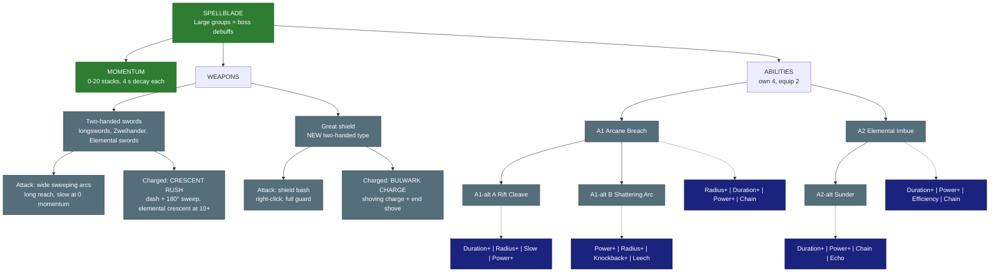

# ⚔️ Spellblade - Melee mage

| | |
|---|---|
| 🎯 **Main role** | Handle large groups (frontline area damage) |
| 🎯 **Second role** | Debuff bosses |
| 📈 **Class skill** | 🔵 Proposed: **Battlemagic** (alternatives: Bladesong, Tempo) - its own XP, like Swordsmanship / Sorcery |
| 💬 **In one line** | Big sweeping arcs that speed up while you keep pressing forward. Elements on the edge. |

- Cloud draft 2026-10-08 (new class, Skyy 2026-10-08). Nothing built. Every number is a placeholder and a Server Setup row.

- Medium speed, medium defence. Deliberate and big: wide sweeping arcs, long reach, timing matters.

- **Momentum:** attacks chain together and grow faster as you keep attacking. Keep pressing forward and it becomes unstoppable.

- Primarily **elemental** (the class that puts our element system on enemies; owns The Armory's shelved Elemental swords), plus a few **non-elemental** area debuffs.

- Party benefit = **debuffs**, not buffs (so it never overlaps the Berserker): **Arcane Breach** (enemies take more damage from everyone) + **momentum push** (allies near you move a little faster at high momentum).

Numbers are placeholders. Labels: 🟢 Locked · 🔵 Proposed · 🟠 Open - see [README.md](README.md).

&nbsp;

## 📌 Decisions this follows (`docs/answered/classes.md`, newest wins)

| Line | Skyy | Used here |
|---|---|---|
| 167 (2026-10-08) | "we should do a mele mage class. So it has a dule purpose. Momentum! medium speed, medium defense, deliberate and big: wide sweeping arcs, long reach, and timing matters. but attacks chain together growing in speed as you continue to attack. so if you can keep pressing forward, your momentum becomes unstoppable." + "yes, call it Spellblade and draft the class page. so its main roll is to handle large groups, AND to debuff bosses. (i want some AOE debuffs that arnt elemental, though he will primarily be elemental. (and i was thinking about a 2 handed great shield as a secondary weapon.)" | the whole page: roles, Momentum, elements, Breach, the great shield |
| 165 (2026-10-08) | second sword class: two-handed swords (longswords, Zweihander, The Armory's Elemental swords), no shield; Warrior = one-handed sword + shield | weapons |
| 161, 162, 166 | Warrior keeps the vanilla sword dash, spears, Challenge / Guardian's Oath | the Warrior gives up longswords + Zweihander (section "For the local session") |
| 36 | 2 weapon types per class, no sharing | two-handed swords + great shield |
| 47, 54 | A1 -> A2 -> A2 swap-out -> one of two improved A1 alternatives; 5 designed, 4 owned, 2 equipped | sections Abilities |
| 50, 51, 55 | levels by use; 4 modifiers per ability, 2 equipped, shared pool, no doubling; Ricochet = projectiles, Chain = effects | modifier lines |
| 52, 54 | class tree = Wynncraft paths that change HOW an ability works; pick one | section Class tree |
| 96, 99 | every traversal costs Mana AND Stamina (magical 2 : 1, physical more Stamina); no traversal cooldowns; traversal Stamina cap 5 | traversal costs |
| 104, 105 | one hold = the charged traversal that is ALSO the attack | both traversals hit on the way |
| 116, 117 | NO void protection on any traversal | both traversals: none |
| 120, 121 | combo stunlock allowed; bosses break out after 3 s x players (cap 4) | Momentum "unstoppable" uses the same breakout code |
| 153-156 | 4 abilities = 2 PRIMARY (Ability 2 / 3: walking / sprinting / mid-air shapes) + 2 ALT (crouch + key: a crouch shape); cost / cooldown per shape; mid-roll cast allowed | every ability has 4 shape lines |
| `docs/answered/gear.md` 112-114, 119 | The Armory: longswords 20, Zweihander, 4 Elemental swords (Flame / Gravity / Ice / Poison) SHELVED until our element system; Warrior "weapon-heavy ... TEMPORARY" | the Spellblade takes them; the Elementals wait for the element spec |

&nbsp;

## 🗺️ Map

&nbsp;

## 🎭 Role and identity

🔵 **Proposed**

- **Frontline sweeper.** Stands in the crowd and clears it with arcs that hit everything in front. Not a tank: no taunt, no party damage cut.

- **Boss debuffer.** Puts debuffs ON the boss (takes more damage, deals less, crits land harder) so the party kills it faster. Never buffs allies directly.

- **The element class.** The Spellblade is how our element system reaches enemies in melee: Imbue colours every arc, the Elemental swords are its weapons, the class tree deepens the elements.

- **Medium everything:** move speed normal (no bonus), defence between the Warrior and the Mage, armor type **Light** (class bonus on-type), Mana **+5 per class level** (half a Mage).

- **Timing matters:** a slow first swing, a fast tenth. Swing in rhythm and the chain grows; stop, get stunned or swap weapons and it falls.

### Overlap check (one line per class)

| Class | They do | The Spellblade does NOT | Shared edge |
|---|---|---|---|
| 🛡️ Warrior | tank, taunt, party damage cut, one-handed sword + shield + spears | taunt or protect the party; its great shield only protects itself and whoever stands right behind it | both hold the front; the Spellblade's guard is a weapon, not an ability |
| 🪓 Berserker | party damage BUFF, self heal by hitting, axes / maces | buff allies | Breach is a DEBUFF on enemies - stacks with Enrage, never replaces it |
| 🥋 Monk | self move + attack speed stacks, single-target stuns, Awe | gain move speed from its stacks; hit single targets | Momentum gives attack speed and arc size only; the Monk stays faster on its feet |
| 🗡️ Assassin | single-target crit burst, Toxin Weaken cloud | crit; hide | Sunder EXPOSES a boss (crits on it hit harder) - the God Killer's best friend |
| 🔮 Mage | ranged elemental burst, Mana shield | shoot or blink | both elemental; the Mage from range, the Spellblade in melee (later: element reactions between them) |
| 🏹 Archer | roots, Hunter's Mark (+damage taken on ONE target) | root | Mark and Breach are both "+damage taken" - rule: the higher one applies, +5% extra when both are on (Question 5) |
| ✨ Priest | heals, shields, saves | heal | none |

&nbsp;

## 🌀 Momentum

🔵 **Proposed** (Skyy's words: "attacks chain together growing in speed as you continue to attack ... your momentum becomes unstoppable")

Momentum is the Spellblade's class resource. It is always on (no ability needed), shown as a stack count on the SkyyHud Abilities widget ("Momentum 14").

### Stacks - how they build

| Rule | Default |
|---|---|
| Max stacks | **20** |
| Per hit landed with a two-handed sword | **+1** per enemy hit, at most **+2 per swing** (a crowd feeds it faster than one target) |
| Great shield bash that hits | +1 |
| **Rhythm bonus** ("timing matters") | start the next swing inside the **flow window** (the 0.4 s after the previous arc finishes) = **+1 extra**. Mashing early does nothing extra (the swing queues as normal); waiting longer than the window loses the bonus |
| Abilities that hit | Arcane Breach +3, Sunder +2, Rift Cleave +3, Shattering Arc keeps 5 |
| Traversals that hit | Crescent Rush +2, Bulwark Charge +1 per enemy shoved (max +3) |
| Misses | nothing (no gain, no loss) |

### Decay and what breaks it

| Event | Effect |
|---|---|
| Time | **each stack decays 4 s after it was gained** (the Monk's rule, a little harsher) - you only reach or hold 20 by hitting non-stop |
| A heavy hit on you (15%+ of max Health in one hit) | **-3 stacks** |
| Stunned, rooted or frozen | **all stacks lost** |
| Swapping sword <-> great shield | keep **half** (the shield is the secondary, swaps must be playable) |
| Swapping to a non-class item | all stacks lost |
| Blocking with the great shield | decay **pauses** while you block (up to 2 s per block) |
| Mana at 0 | the element part stops; Momentum itself keeps going (it costs nothing) |

### What stacks change

| Per stack | At 20 |
|---|---|
| **Attack speed +1.5%** | +30% (the Monk's Flowing Form peak; the Spellblade starts a whole speed tier slower, so it ends about where a normal sword is) |
| **Arc size +1%** (wider arc, longer reach) | +20% reach and width |
| **Element strength +1%** (Imbue damage and status strength) | +20% |

### Tiers

| Tier | Stacks | Extra |
|---|---|---|
| Building | 1-6 | nothing extra |
| **Rolling** | 7-13 | **Momentum push**: allies within 8 blocks get **+5% move speed** (an aura, only while inside); your swings bump the weapon **one speed tier** (SkyyGear tiers: Slow -> Normal) |
| **Unstoppable** | 14-20 | momentum push **+10%**; your swings **cannot be interrupted** by hit-stun or knockback (the same "breakout" code bosses use); Imbue statuses last **+50%** |

- Momentum push is the party benefit next to Breach. It is small on purpose: a little move speed, never attack speed or damage (the Monk and Berserker own those).

- **Why 4 s decay and not 5:** the Spellblade has long reach and area hits, so it builds faster than the Monk; a shorter decay keeps "keep pressing forward" true.

&nbsp;

## ⚔️ Weapons

### Two-handed swords (The Armory's 20 longswords + the Zweihander + the 4 Elemental swords; our own Spellblade swords later)

🔵 **Proposed** (weapons named by Skyy 2026-10-08; the move set is ours to design)

- **Attack:** big deliberate **sweeping arcs** - a 3-swing chain (left arc, right arc, overhead) hitting every enemy in a **120° arc, 3.5 blocks reach** (vs a sword's ~2.5). Starts a speed tier SLOWER than a sword (Weapon-Speed-Tiers: Longsword Slow 1.4x); Momentum closes the gap. The overhead (3rd swing) is the heavy hit: 1.3x, small knockback.

- **Elemental swords** (Flame / Gravity / Ice / Poison, SHELVED by Skyy until the element system): each carries its own element; Imbue on such a sword uses the sword's element automatically (no attunement needed). Proposed mapping to the engine's elements in section Elements.

- **Charged = CRESCENT RUSH** (doubles as the attack): hold + release to **dash forward 6 blocks** and finish with a **180° sweep** (1.5 H, reach 4). The dash grows with Momentum (+0.15 blocks per stack, 9 blocks at 20). At **10+ Momentum** the sweep also sends an **elemental crescent** 8 blocks forward (0.8 H element damage, applies the Imbue status if active). Grants +2 Momentum on hit.

  - Cost: **8 Mana + 4 Stamina** (half-magical: between the staff's 2 : 1 and the Monk's physical split). No cooldown. Stamina cap 5 like every traversal.

  - No void protection (Skyy 2026-10-07). Walls stop it; it never ends inside a block.

  - Differs from the Berserker's Whirlwind Dash (a spin along the ground hitting all around) and the Warrior's Thrust (a straight stab): one dash, one huge frontal arc, a wave.

- **Longswords' own move set:** The Armory's longswords use The Armory's animations and chains. Giving them our arcs needs a runtime hook or a CC BY-NC override (the same open point as the Warrior's dash, line 161) - decide with the 0.7 Armory work. Our own Spellblade swords ship with the arc move set natively (SkyyArmory, Copper -> Onyxium like the wands; art via the art skill).

### Great shield (NEW two-handed weapon type; Copper -> Onyxium, SkyyArmory)

🔵 **Proposed** (Skyy: "i was thinking about a 2 handed great shield as a secondary weapon")

- **Look:** a tower shield as tall as the player, held with both hands (one strap, one grip bar), heavy metal rim in the tier's metal, a wooden or metal face, and a **rune in the centre that glows in the Spellblade's current element** (dim when nothing is imbued). Copper is plain and riveted; Mithril has gold trim and an etched sigil; Onyxium is black glass with a violet rune. Concept sheet later (art skill rules).

- **Role:** the Spellblade's "hold the line" weapon. Less damage, more control: it shoves, it blocks, it keeps Momentum alive while you are surrounded. Swap to it when the crowd pushes back; swap to the sword to clear it.

- **Attack (left click):** a **shield bash** - slow, 2.5 blocks reach, 90° front, 0.7 H, **knockback 2 blocks**, +1 Momentum on hit. The 3rd bash in a chain is a **slam** (1.0 H, knockback 3, small stagger 0.3 s).

- **Guard (right click, hold):** a **full-body guard**: blocks **100% of projectiles** from the front and **70% of melee** from the front; you move **30% slower**; Momentum decay pauses (up to 2 s per guard); **allies right behind you** (within 2 blocks, in your shadow) take **25% less** from the front. Costs Stamina per blocked hit like a vanilla shield.

  - Built like the Monk Bo's right-click block (SkyyArmory, live since 2026-10-07): a non-shield item with a server-side guard.

- **Charged = BULWARK CHARGE** (doubles as the attack): hold + release to **charge forward 8 blocks** shield-first; every enemy in the path is **shoved aside or carried** (0.6 H each, staggered 0.5 s), and the charge ends with a **shove**: a 3-block-wide push, knockback 4, 1.0 H. +1 Momentum per enemy (max +3). At Unstoppable the carried enemies are **knocked down** (stun 1 s) at the end.

  - Cost: **4 Mana + 5 Stamina** (physical: more Stamina than Mana). No cooldown. No void protection.

  - Differs from the club's Bull Rush (Berserker, damage on the way): the great shield carries and dumps the crowd, the club just hits through it.

- **Signature-level idea for later:** a great shield rune that stores the last element you blocked and bashes it back - a class-tree node, not now.

&nbsp;

## 🌈 Elements (dependency: the element system is not designed yet)

🟠 **Open** - no element spec exists in the repo (grep 2026-10-08: `research/Hytale-Runes-Research.md` lists the engine's damage causes; `research/cloud/Class-Tree-Paths.md` uses the five for the Priest's Elemental Bubble; `docs/plans/SkyWynn-Decisions.md` holds the Wynncraft stat model). The Spellblade NEEDS it; until then every element line here is a proposal and Imbue can ship with Fire only.

| Element (engine / SkyyGear name) | Wynncraft stat name | Proposed status on hit | Armory Elemental sword |
|---|---|---|---|
| **Fire** | Fire | **Burn**: 0.1 H per second for 4 s (stacks to 3) | Flame |
| **Water** | Water | **Chill**: -15% move + attack speed 3 s; 3 Chills = **Freeze** 1.5 s | Ice |
| **Earth** | Earth | **Stagger**: every 3rd Earth hit staggers 0.4 s and -10% defence 4 s | Gravity (pulls down / roots - Question 7) |
| **Wind** | Air | **Gust**: knock-up 0.5 s on the heavy hit, +1 block knockback on all | - |
| **Lightning** | Thunder | **Shock**: the hit jumps to 1 enemy within 3 blocks at 40%; shocked enemies take +5% from everyone 3 s | - |
| (none) | - | **Poison** = a status, not an element (vanilla Poison Imbue rune): 0.08 H per second 6 s | Poison |

- Vanilla engine facts (VERIFIED in `research/Hytale-Runes-Research.md`): damage causes Earth / Water / Wind / Lightning (children of Elemental) + Fire exist with their own damage-number colours; `ReactionDamageSystem` supports element REACTIONS but vanilla uses none. Reactions (Burn + Gust = spreading fire, Chill + Shock = shatter) are a later class-tree layer, not v1.

- SkyyGear already carries flat Earth / Thunder / Water / Fire / Air damage on weapons (Stats page: LIVE). Imbue adds its element damage THROUGH that pipeline so gear element % and element defence apply (UNVERIFIED: whether ability damage with an element cause is scaled by the gear stats today).

- **Attunement** (which element Imbue uses when the sword has none): picked on the class page out of combat, default **Fire**; the Tempest path unlocks a second. Elemental swords override it.

- Proposed owner: a short element-system spec in `research/cloud/` (planned name Element-System-Spec; elements, statuses, stacking, boss rules, reactions later) before the Spellblade build.

&nbsp;

## ✨ Abilities

You own 4. You equip 2 as primaries (Ability 2 / 3: walking, sprinting, mid-air shapes); the other 2 are your alts (crouch + key: the crouch shape). Costs are Mana; cooldown per shape; **H** = one full arc hit at your level. Boss rule: debuffs below are NOT crowd control, so bosses take them at full strength (stuns / slows inside them are halved as usual).

### A1 · Arcane Breach

🔵 **Proposed** - the party debuff, NON-elemental (unless imbued)

- **Does:** a wide **180° arc** in front of you, **5 blocks reach**: 1.2 H to every enemy hit and **BREACHED for 8 s: they take +15% damage from EVERYONE** (players, party, pets, your own arcs). +1% per Momentum stack at the cast (cap +25%). Grants +3 Momentum. If Imbue is active the arc also carries the element and its status.

- Works on bosses at full strength: this is the first boss debuff.

- **Levels:** +0.5% Breach per level (cap 30% with modifiers and paths).

| Shape | What changes | Cost / CD |
|---|---|---|
| Walking | the 180° arc, 5 blocks, Breach 15% 8 s | 14 / 16 |
| Sprinting | **Breaching Charge**: a 2-block step in, then the arc; Breach 15% 7 s; the step keeps the rhythm (counts as inside the flow window) | 14 / 16 |
| Mid-air | **Breach from Above**: a 4-block circle under your landing spot (360°), 1.0 H, Breach 15% 8 s, small knock-up | 14 / 18 |
| Crouch (alt) | **Marked Ground**: 360°, 3.5 blocks, no damage, Breach **20%** 8 s - the precise "mark everyone around me" button; never moves you | 12 / 16 |

**Modifiers**

- ⭕ **Radius+** - longer and wider arc.

- ⏳ **Duration+** - Breach lasts longer (max +2 s).

- 💪 **Power+** - more damage and a higher Breach % (of the value: 15% -> 18.75% at Lv 5).

- ⛓️ **Chain** - Breach jumps to the nearest enemy you did NOT hit (+1 per level) - the stragglers behind the crowd.

- **Echo?** Proposed **no** - a second Breach would only refresh a debuff. Offer Echo on the A1-alts instead (below).

### A1-alt A · Rift Cleave

🔵 **Proposed** - pick A or B (both better than Breach, different)

- **Does:** Breach that leaves a **RIFT**: the arc (160°, 5 blocks, 1.2 H) tears a **2 x 8 block line** on the ground along your look direction for **3 s**; enemies inside are **Breached 15%** and **Slowed 20%**; if imbued the rift is an element patch (Burn / Chill / ... each second). Trades the instant width for a zone that holds a doorway.

| Shape | What changes | Cost / CD |
|---|---|---|
| Walking | arc + the 2 x 8 rift ahead, 3 s | 18 / 20 |
| Sprinting | **Running Rift**: the rift forms BEHIND you as you run (2 x 10) - covers a retreat through a crowd | 18 / 20 |
| Mid-air | **Rift Drop**: a 5-block circle rift under your landing spot, 3 s | 18 / 22 |
| Crouch (alt) | **Rift Ring**: a 4-block ring around you, 4 s, Breach 18%; never moves you | 18 / 22 |

**Modifiers**

- ⏳ **Duration+** / ⭕ **Radius+** - longer-lasting / longer rift.

- 🐌 **Slow** - stronger slow inside the rift.

- 💪 **Power+** - more damage and Breach %.

- **Echo?** Proposed **yes** (a weaker rift forms once more 1 s after the first ends - Echo `repeatFx` like Starfall; each level: stronger echo). Skyy's call (Question 8).

### A1-alt B · Shattering Arc

🔵 **Proposed** - pick A or B

- **Does:** Breach that **SPENDS your Momentum**: one enormous **200° arc, 6 blocks reach**; damage **1.2 H + 0.1 H per stack spent** (3.2 H at 20), Breach **15% + 1% per stack** (cap 30%) for **8 s + 0.25 s per stack**. After it you keep **5 stacks** (a floor, so the chain does not die). The big burst for a crowd - at the price of your speed.

| Shape | What changes | Cost / CD |
|---|---|---|
| Walking | the arc above | 16 / 20 |
| Sprinting | **Shattering Rush**: a 3-block step in first; spends all stacks; reach 6 | 16 / 20 |
| Mid-air | **Shattering Fall**: lands as a 5-block circle (360°), 1.0 H + 0.1 H per stack, knock-up 0.5 s | 16 / 22 |
| Crouch (alt) | **Measured Strike**: spends only HALF your stacks (rounded up), same per-stack numbers, 160° arc; never moves you | 14 / 20 |

**Modifiers**

- 💪 **Power+** - more per stack.

- ⭕ **Radius+** - bigger arc.

- 💥 **Knockback+** - the arc throws the crowd back.

- 🩸 **Leech** - heal for part of the damage.

- **Echo?** Proposed **yes** (a second weaker arc 1 s later at the Echo %, spending nothing). Skyy's call (Question 8).

### A2 · Elemental Imbue

🔵 **Proposed** - the elemental core

- **Does:** for **12 s** every arc, bash and crescent you land deals **+30% as element damage** of your sword's element (or your attuned element) and applies that element's **status** (section Elements). Momentum raises both (+1% per stack; statuses +50% duration at Unstoppable). The great shield's rune glows in the element while it runs.

- No cost per hit, no drain: pay once, swing freely. Ends early if you swap to a non-class item.

| Shape | What changes | Cost / CD |
|---|---|---|
| Walking | self imbue 12 s | 12 / 18 |
| Sprinting | **Charging Imbue**: imbue 12 s AND an immediate elemental crescent 8 blocks forward (0.8 H element) | 14 / 18 |
| Mid-air | **Falling Imbue**: imbue 12 s AND a 4-block elemental burst where you land (0.8 H element, applies the status) | 14 / 20 |
| Crouch (alt) | **Deep Imbue**: 15 s, statuses last +25%, you stand still 0.5 s to draw the rune; never moves you | 14 / 20 |

**Modifiers**

- ⏳ **Duration+** - longer imbue.

- 💪 **Power+** - more element damage.

- 💧 **Efficiency** - cheaper.

- ⛓️ **Chain** - the element's STATUS jumps to one more enemy within 6 blocks on each hit (+1 per level).

- **Echo?** No (a buff on you; nothing to repeat).

### A2-alt · Sunder

🔵 **Proposed** - the BOSS debuff, NON-elemental

- **Does:** a heavy overhead strike on **one target** (the enemy you look at within 4 blocks): **2.0 H**, and the target is **SUNDERED for 12 s: it deals 15% less damage (Weakened) and is EXPOSED - crits on it deal +20% crit damage, from everyone**. Full strength on bosses and mini-bosses (not crowd control). Grants +2 Momentum.

- Breach and Sunder stack (take more + deal less + crit harder): the Spellblade's two boss keys. Next to the Assassin's God Killer this is the kill window.

| Shape | What changes | Cost / CD |
|---|---|---|
| Walking | single target, 4 blocks, 2.0 H, 12 s | 16 / 30 |
| Sprinting | **Lunging Sunder**: a 3-block step in first (closes on a boss), 1.8 H, 12 s | 16 / 30 |
| Mid-air | **Sunder from Above**: hits the target below your landing point, 2.4 H, +0.5 s stagger on non-bosses | 16 / 32 |
| Crouch (alt) | **Armour Break**: 1 s wind-up, 2.0 H, Sunder **15 s** and -10% defence on top; never moves you | 18 / 34 |

**Modifiers**

- ⏳ **Duration+** - longer Sunder (max +2 s on the status rule; the ability's own 12 s may go to 14).

- 💪 **Power+** - more damage, stronger Weaken / Expose.

- ⛓️ **Chain** - Sunder also hits the nearest second enemy within 6 blocks at 75% (two bosses, or boss + its guard).

- 🔁 **Echo** - a second, weaker overhead strike 1 s later at the Echo % (refreshes nothing, just damage) · each level: stronger echo. **Echo? yes** - it is a strike, like God Killer / Palm Strike.

### Good primary pairs

- **Breach + Imbue** (the default: colour the crowd, then mark it).

- **Imbue + Sunder** (boss duty: element on, boss sundered; Breach as the crouch alt marks the adds).

- **Rift Cleave + Imbue** (hold a corridor with an element patch).

- **Shattering Arc + Sunder** (the burst build; Imbue as an alt).

&nbsp;

## 🔆 Signature ideas (Ability 1 = the weapon signature, vanilla charge meter filled by hits)

🔵 **Proposed** - 3 options per weapon, pick one (same pattern as `research/cloud/Signature-Proposals.md`; charge from ~8-10 hits)

| Weapon | Option | What it does |
|---|---|---|
| Two-handed sword | **Meridian Cut** (recommended) | two arcs at once - a vertical cut and a horizontal sweep crossing in front of you: 2.5 H in a 160° arc, reach 5; applies the Imbue status twice (so Chill freezes, Burn stacks) |
| Two-handed sword | Crescent Wave | one big elemental wave 12 blocks forward, 3 blocks wide, 2.0 H element damage, pierces everything (the "melee mage" shot) |
| Two-handed sword | Full Momentum | instantly sets Momentum to 20 and makes it decay-free for 6 s (no damage) |
| Great shield | **Iron Curtain** (recommended) | slam the shield down: a 3-block-wide wall of force stands 4 s where you aimed - blocks projectiles both ways, shoves melee enemies that touch it 2 blocks |
| Great shield | Rebound | the next 3 hits you block are thrown back as crescents at the attacker (0.8 H each) |
| Great shield | Rally Point | a 6-block circle for 6 s: allies inside take 15% less from the front and gain the momentum push at full value (the shield's team moment) |

- Vanilla signature roots for a new family are UNVERIFIED (same as the Bo / fists / kunai signatures).

&nbsp;

## 🧩 Modifier pool

Each ability offers 4 of these. You equip 2.

<!-- POOL START - tools/class_pages.py copies this block into every class file (python tools/class_pages.py --sync-pool) -->
- ⏳ **Duration+** - lasts longer · each level: more time.

- ⭕ **Radius+** - bigger area · each level: more blocks.

- 💪 **Power+** - stronger main effect (damage, heal, shield, buff) · each level: more %.

- 💧 **Efficiency** - costs less Mana / Stamina · each level: lower cost.

- 🔱 **Split** - splits into 3 weaker copies (projectiles, lines) · each level: stronger copies.

- 🎱 **Ricochet** - PROJECTILES only: the shot flies on to the next enemy after a hit (walls block it, it can miss) · each level: +1 bounce.

- 📌 **Pierce** - passes through enemies · each level: +1 enemy.

- ⛓️ **Chain** - EFFECTS only (heals, buffs, debuffs, poison, hooks): jumps instantly to the next target in range - enemies, or allies for support · each level: +1 jump.

- 🔥 **Lingering** - leaves a zone behind (fire, poison, light) · each level: longer zone.

- 🐌 **Slow** - adds a slow · each level: stronger slow.

- 💥 **Knockback+** - pushes enemies away · each level: farther.

- 🧲 **Pull** - draws enemies in · each level: stronger pull.

- 👣 **Follow** - a placed zone moves with you instead · each level: bigger zone.

- 🩸 **Leech** - heals you for part of the damage · each level: more %.

- 🛡️ **Ward** - adds a small shield (you, or allies for support abilities) · each level: bigger shield.

- ⚡ **Haste** - attack + move speed for a few seconds after use · each level: longer.

- 🔁 **Echo** - repeats once after 1 s at reduced strength · each level: stronger echo.
<!-- POOL END -->

&nbsp;

## 🌳 Class tree paths

Ideas, Wynncraft-style - pick one at its first node, the other two lock (shape and gates as `research/cloud/Class-Tree-Paths.md` section 0: trunk Lv 5 / 10 / 15 / 25 / 40 / 55, paths Lv 20 / 30 / 45 / 65 / 75, 25 points for trunk + one path; every node has a trade-off).

**Trunk** (every path gets these)

| Node | Lv | Pts | Effect |
|---|---|---|---|
| T1 Long Arm | 5 | 1 | arc reach +0.25 blocks |
| T2 Steady Guard | 10 | 1 | great shield guard costs 15% less Stamina; +5% max Health |
| T3 Far Crescent | 15 | 2 | Crescent Rush and Bulwark Charge go 15% farther and cost 10% less Stamina |
| T4 Second Wind | 25 | 2 | once per 60 s, when Momentum would drop to 0 from a stun it keeps 5 instead |
| T5 Keen Edge | 40 | 2 | +5% damage with two-handed swords and great shields |
| T6 Tempo | 55 | 3 | all Spellblade ability cooldowns -5% |

**Path A - Tempest** (the elements: more of them, deeper)

| Node | Lv | Pts | Ability | What changes | Trade-off |
|---|---|---|---|---|---|
| E1 Twin Attunement | 20 | 2 | Imbue | pick a **second** attuned element; Imbue alternates them per cast (Fire, then Water ...) | Imbue duration -2 s |
| E2 Burning Rift | 30 | 2 | Rift Cleave / Breach | the imbued arc leaves **element patches** (2 s) where it hits | cost +3 Mana |
| E3 Reaction | 45 | 3 | all | a status of one element hit by ANOTHER element **reacts** (Burn + Gust spreads, Chill + Shock shatters: 1.0 H burst; needs the element spec) | element damage -10% |
| E4 Crescent Storm | 65 | 3 | Crescent Rush | the crescent fires from **5+ Momentum** and splits into 3 | dash 1 block shorter |
| E5 Tempest | 75 | 4 | Imbue | at Unstoppable every 5th hit releases a **ring of your element** (1.0 H, 4 blocks) | Momentum decay 4 -> 3.5 s |

**Path B - Breaker** (boss debuffs)

| Node | Lv | Pts | Ability | What changes | Trade-off |
|---|---|---|---|---|---|
| B1 Deep Breach | 20 | 2 | Arcane Breach | Breach on bosses / mini-bosses **+5 points** | Breach on normal mobs -3 points |
| B2 Armour Split | 30 | 2 | Sunder | Sunder also **-10% defence** | cooldown +4 s |
| B3 Opening | 45 | 3 | Sunder | a Sundered boss's **breakout window** (the stunlock rule) is 1 s longer for the whole party | you take +10% from Sundered targets |
| B4 Marked for Death | 65 | 3 | Breach + Sunder | a target with BOTH takes **+10% more** from everyone | Breach duration -1 s |
| B5 Breaker | 75 | 4 | Sunder | Sunder's first hit on a boss **removes one buff / shield** it carries (elite affixes count) | cost +6 Mana |

**Path C - Vanguard** (the great shield + Momentum on the front line)

| Node | Lv | Pts | Ability | What changes | Trade-off |
|---|---|---|---|---|---|
| V1 Shield Rhythm | 20 | 2 | great shield | bashes give **+2** Momentum; guard pause 2 -> 3 s | sword hits give at most +1 per swing |
| V2 Wide Shadow | 30 | 2 | guard | allies protected behind the guard: 2 -> **4 blocks**, 25% -> 30% | you move 35% slower while guarding |
| V3 Momentum Push | 45 | 3 | Momentum | the push aura reaches **12 blocks** and also gives allies **+5% attack speed** at Unstoppable (the one place Momentum buffs allies' speed; the Monk's self stacks stay bigger) | your own attack speed per stack 1.5 -> 1.25% |
| V4 Carry Through | 65 | 3 | Bulwark Charge | carried enemies are dumped in a **pile** at the end (pulled to one point, Breached 10% 4 s) | charge 2 blocks shorter |
| V5 Vanguard | 75 | 4 | Momentum | Unstoppable also gives **-15% damage taken** | max Momentum 20 -> 18 |

&nbsp;

## ⚙️ Server Setup rows (sketch; SkyWynn Menu -> Server Setup -> Classes; times in seconds; all live)

| Key | Label | Default |
|---|---|---|
| class.spellblade.enabled | Spellblade class | false until built (the Shaman-slot pattern) |
| class.spellblade.manaPerLevel | Spellblade max Mana per level | 5 |
| mom.max / mom.decay | Momentum max / decay per stack | 20 / 4 |
| mom.perHit / mom.maxPerSwing / mom.rhythm | Momentum per hit / most per swing / rhythm bonus | 1 / 2 / 1 |
| mom.flowWindow | Flow window | 0.4 |
| mom.aspdPerStack / mom.arcPerStack / mom.elemPerStack | Attack speed / arc size / element per stack (%) | 1.5 / 1 / 1 |
| mom.rolling / mom.unstoppable | Rolling at / Unstoppable at | 7 / 14 |
| mom.pushRolling / mom.pushUnstoppable / mom.pushRange | Momentum push move speed (%) / range | 5 / 10 / 8 |
| mom.heavyHitPct / mom.heavyHitDrop | Heavy hit threshold (% max Health) / stacks lost | 15 / 3 |
| mom.swapKeep / mom.guardPause | Kept on sword-shield swap (%) / guard pause | 50 / 2 |
| trav.crescent.dist / .perStack / .mana / .stamina / .waveAt | Crescent Rush distance / per stack / Mana / Stamina / crescent from | 6 / 0.15 / 8 / 4 / 10 |
| trav.bulwark.dist / .mana / .stamina / .shove | Bulwark Charge distance / Mana / Stamina / end shove | 8 / 4 / 5 / 4 |
| gshield.front / gshield.proj / gshield.slow / gshield.allyCut / gshield.allyRange | Great shield melee cut (%) / blocks projectiles / move slow (%) / ally cut (%) / ally range | 70 / true / 30 / 25 / 2 |
| breach.markRule | Breach + Mark on one target | higher + 5 (choice: higher, add, higher + 5) |
| elem.attuneDefault | Default attuned element | Fire |
| ab.Breach.* / ab.RiftCleave.* / ab.ShatteringArc.* / ab.Imbue.* / ab.Sunder.* | per shape mana / stamina / cooldown / duration / radius / power | the tables above (category abilx) |

&nbsp;

## ⚠️ Engine risks (all UNVERIFIED - no game files in the cloud)

| # | Risk | Fallback |
|---|---|---|
| 1 | **The Armory longswords' move set** is theirs (animations + chains); our arcs on them need a runtime hook or a CC BY-NC override (line 161's open point) | our own Spellblade swords first (SkyyArmory items with the arc chain); Armory longswords keep their chain + get Momentum / traversal only |
| 2 | **Arc reach and width change at runtime** (+20% at 20 stacks): vanilla melee hit detection is client-predicted in the item chain | server-side extra cone scan on each swing for the Momentum bonus hits (`TargetUtil.getAllEntitiesInSphere` + angle test - the SkyyArmory trail pattern) |
| 3 | **Attack speed per stack**: SkyyGear picks swing timing by hidden-effect speed TIERS (4 discrete) and strips foreign speed effects every second (probe plan finding); Skyy 2026-10-08: speed buffs bump the weapon ONE tier, temporarily | Momentum tiers map to speed tiers (Rolling = +1 tier); the smooth per-stack % waits for the SkyyGear "ability haste" bridge |
| 4 | **Flow window** needs the swing start / end times (Primary `InteractionChainStartEvent`, probe P2) | count hits only: a hit within 0.4 s + the swing time of the last hit = the rhythm bonus |
| 5 | **Two-handed guard item**: a non-shield item that blocks on right-click | the Monk Bo right-click block (SkyyArmory, live 2026-10-07) is the pattern |
| 6 | **Carrying / shoving mobs** during Bulwark Charge (the Monk probes 7-8 asked the same API: dragging mobs) | if mobs cannot be moved along the path, the charge only damages + staggers on the way and the end shove does the pushing |
| 7 | **Unstoppable = no hit-stun** on the player: what interrupts a player's swing (knockback, stagger effect, damage) | the boss breakout mechanism (strip the KnockbackComponent; live in SkyyArmory 0.1.9) applied to the Spellblade for the tier |
| 8 | **Breach / Weaken / Expose** = damage FILTER-group hooks (the DamageLock pattern, VERIFIED hook shape); order vs SkyyGear / SkyyMobs systems and vs the Archer's Mark | multiplication commutes; the Mark rule is a lookup in one place |
| 9 | **Element damage through SkyyGear's stats** (does an ability hit with a Fire cause get the weapon's Fire % and the target's Fire defence?) | if not: a plain damage multiplier per element until the element spec lands |
| 10 | **Statuses** (Burn, Chill, Freeze, Stagger, Gust, Shock) are our own effects (engine E7 CC round); Freeze = root + no attack | ship Imbue with Fire (Burn = damage over time only) first |
| 11 | **Elemental sword ids** `Weapon_Elemental_*` (The Armory, shelved) reach the class table only when unshelved; `Longsword_` / Zweihander ids move from the Warrior gate to the Spellblade | one class-table entry per family (the flail rule) |
| 12 | **An 8th class** in SkyyClasses: profiles, kit, class page, HUD, the trees (SkyyTrees page 2), the emblem (class-art), `tools/class_pages.py` CLASSES list | the Monk / Assassin round (SkyyClasses 0.1.14) is the template |

&nbsp;

## 🟠 Open

- Class skill name (Battlemagic / Bladesong / Tempo).

- A1-alt pair (Rift Cleave / Shattering Arc) and whether they get Echo.

- The element system spec (needed before Imbue is more than Fire).

- Which element the Armory's Gravity sword maps to.

- The Breach + Hunter's Mark rule.

- Engine checks 1-12 above.

&nbsp;

## ❓ Questions for Skyy (each with a recommended default)

| # | Question | Recommended default |
|---|---|---|
| 1 | Class skill name: Battlemagic, Bladesong or Tempo? | **[Battlemagic]** |
| 2 | Momentum: 20 stacks, 4 s decay per stack, +1 per enemy hit (max +2 per swing), rhythm bonus +1 inside a 0.4 s flow window? | **[yes, all live rows]** |
| 3 | What stacks change: attack speed +1.5% / arc size +1% / element +1% per stack; Rolling at 7 (push +5% ally move speed, +1 speed tier), Unstoppable at 14 (push +10%, no hit-stun, statuses +50%)? | **[yes]** |
| 4 | What breaks it: heavy hit -3, stun / root / freeze = all, sword-shield swap keeps half, guard pauses decay 2 s? | **[yes]** |
| 5 | Breach (+15% taken, area, 8 s) next to the Archer's Mark (+15% on one target): higher applies + 5% when both, or they add fully (+30%)? | **[higher + 5%]** |
| 6 | The kit: A1 Arcane Breach, A2 Elemental Imbue, A2-alt Sunder, A1-alt Rift Cleave or Shattering Arc - keep, swap or rename? | **[keep; A1-alt A Rift Cleave as the first to build]** |
| 7 | Elements: the engine's five (Fire, Water, Earth, Wind, Lightning) with the statuses tabled; Poison = a status, not an element; the Armory's Gravity sword = Earth (pull-down / root flavour)? | **[yes; Gravity = Earth]** |
| 8 | Echo: on Sunder (yes), on the A1-alts (yes), not on Breach / Imbue? | **[as listed]** |
| 9 | Great shield: bash + full guard (100% projectiles, 70% melee, allies behind you 25% less) + Bulwark Charge (8 blocks, carry + end shove)? Guard costs Stamina per blocked hit like vanilla shields? | **[yes]** |
| 10 | Traversal costs: Crescent Rush 8 Mana + 4 Stamina, Bulwark Charge 4 Mana + 5 Stamina, no cooldowns, no void protection? | **[yes]** |
| 11 | Signatures: Meridian Cut (sword) and Iron Curtain (great shield)? | **[yes]** |
| 12 | Medium stats: Mana +5 per class level (the Priest's rate), armor type Light, no move-speed change, defence between Warrior and Mage? | **[yes]** |
| 13 | Paths: Tempest (elements) / Breaker (boss debuffs) / Vanguard (great shield + Momentum)? | **[yes]** |
| 14 | The Warrior gives up longswords + the Zweihander now (class table + its page), keeping one-handed swords, shields and spears? | **[yes - it was 'weapon-heavy, temporary' anyway]** |
| 15 | Build order: after the Monk / Assassin rounds and the ability engine E1-E4; the Spellblade swords + great shield as a SkyyArmory round first, Momentum second, abilities with the engine? | **[yes; element spec in the cloud before Imbue]** |

&nbsp;

## 🧪 For the local session (UNVERIFIED / needs the game files or local-owned files)

- Engine risks 1-12 above; the Monk probe results for dragging mobs (probes 7-8) decide Bulwark Charge's carry.

- **Files that still say the Warrior owns longswords / Zweihander** (not edited from the cloud): `research/classes/Warrior.md` (map + weapons), `research/classes/README.md` (class table: add the Spellblade row, weapons "Two-handed swords, Great shield"), `research/cloud/Class-Tree-Paths.md` (a Warrior T5 note is fine; an Spellblade section = this page's tree), `research/cloud/Own-Specials-Draft.md` + `research/cloud/Untiered-Mythic-Spec.md` (the Zweihander and the 4 Elementals move from Warrior pools to the Spellblade; the UT grid grows from 14 to 16 weapon types: two-handed sword, great shield), `research/Pack-Armor-Plan.md` (gate table `Longsword_` / Zweihander / `Weapon_Elemental_` -> Spellblade), `research/cloud/Weapon-Speed-Tiers.md` (Longsword Slow 1.4 is the Spellblade's base tier), `research/cloud/Class-Ability-Shapes.md` (add a section 8b from the tables here).

- `tools/class_pages.py` CLASSES list needs "Spellblade" (then `python tools/class_pages.py` rebuilds the HTML; the pool block above is a verbatim copy of README's).

- `docs/answered/classes.md` line 167 names this page; no new answer to append until Skyy answers the questions.

- Art: an Spellblade class emblem + the great shield concept sheet (read `.claude/skills/skywynn-art/SKILL.md` first); not part of this draft.

- Vanilla checks: the longsword / Zweihander item ids and chains in The Armory (Assets, CC BY-NC); whether a two-handed item can block (the Bo block build is the reference); vanilla element damage causes applied from a plugin hit (`Damage$EntitySource` + an element cause).

&nbsp;

## 📜 Change log

- 2026-10-08: file created (cloud draft) from Skyy's 2026-10-08 lines 165 + 167: roles, overlap table, Momentum system, two-handed swords + Crescent Rush, great shield + Bulwark Charge, elements proposal (dependency), Arcane Breach / Rift Cleave / Shattering Arc / Elemental Imbue / Sunder with 4 shapes each, signatures, class tree (trunk + Tempest / Breaker / Vanguard), Server Setup rows, engine risks, 15 questions.
