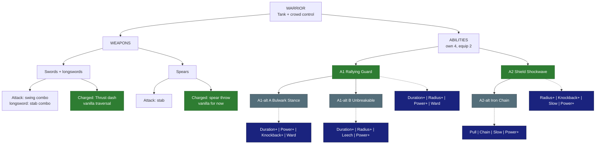

# 🛡️ Warrior - Tank

| | |
|---|---|
| 🎯 **Main role** | Tank |
| 🎯 **Second role** | Crowd control |
| 📈 **Class skill** | Swordsmanship |
| 💬 **In one line** | Sturdy. Holds mobs. Protects the party. |

Numbers are placeholders. Labels: 🟢 Locked · 🔵 Proposed · 🟠 Open - see [README.md](README.md).

&nbsp;

## 🗺️ Map

&nbsp;

## ⚔️ Weapons

### Swords (incl. longswords)

🟢 **Locked** - vanilla for now (Skyy 2026-10-05: custom traversals come later)

- **Attack:** vanilla swing combo. Longswords: a stab combo.

- **Charged / traversal:** swords use the vanilla **Thrust dash** (needs a little Stamina). Longswords: a charged stab with no movement.

- 💡 **Idea for later - not decided yet:** longswords have no traversal of their own; share the sword's dash?

### Spears

🟢 **Locked** - vanilla for now (Skyy 2026-10-05: custom traversals come later)

- **Attack:** vanilla stab.

- **Charged:** vanilla **spear throw** (a projectile, no movement).

- 💡 **Idea for later - Spear Leap:** leap to where you aim and slam down, knocking enemies back.

&nbsp;

## ✨ Abilities

You own 4. You equip 2.

### A1 · Rallying Guard

🟢 **Locked**

- **Does:** you + your party within 6 blocks take **20% less damage** for 6 s.

- Mobs within 8 blocks **turn to attack you** for 4 s.

- **Levels:** +1% damage reduction per level (cap ~30%).

**Modifiers**

- ⏳ **Duration+** - +1 s per level.

- ⭕ **Radius+** - +1 block (party and taunt) per level.

- 💪 **Power+** - +3% damage reduction per level.

- 🛡️ **Ward** - the party also gets a small shield (5% max Health, +1% per level).

### A1-alt A · Bulwark Stance

🔵 **Proposed** - pick A or B

- **Does:** a stance for 8 s. **50% less damage from the front.** Front projectiles are blocked.

- You move 30% slower.

- Allies right behind you take 25% less damage.

**Modifiers**

- ⏳ **Duration+** / 💪 **Power+** - longer stance / more damage reduction.

- 💥 **Knockback+** - enemies that hit your front get pushed back.

- 🛡️ **Ward** - allies behind you also get a small shield.

### A1-alt B · Unbreakable

🔵 **Proposed** - pick A or B

- **Does:** taunt mobs within 8 blocks.

- For 5 s you **cannot drop below 1 HP**.

- When it ends you heal 20% of the damage you took during it.

**Modifiers**

- ⏳ **Duration+** / ⭕ **Radius+** - longer window / bigger taunt.

- 🩸 **Leech** - you also heal for part of the damage you deal during it.

- 💪 **Power+** - the end heal is bigger.

### A2 · Shield Shockwave

🟢 **Locked**

- **Does:** slam your shield. A **6-block cone** stuns enemies ~1.5 s and deals one weapon hit.

**Modifiers**

- ⭕ **Radius+** - longer cone.

- 💥 **Knockback+** - stunned enemies are also pushed away.

- 🐌 **Slow** - enemies stay slowed after the stun.

- 💪 **Power+** - longer stun / more damage.

### A2-alt · Iron Chain

🔵 **Proposed**

- **Does:** throw a chain up to 15 blocks. It hooks the first enemy, **drags it to you** and stuns it 1 s.

- Use it to peel mobs off allies or pull archers in.

**Modifiers**

- 🧲 **Pull** - drags faster, works on bigger mobs.

- ⛓️ **Chain** - also hooks the nearest enemy next to the first.

- 🐌 **Slow** - the dragged enemy stays slowed.

- 💪 **Power+** - longer stun / more damage.

&nbsp;

## 🧩 Modifier pool

Each ability offers 4 of these. You equip 2.

<!-- POOL START - tools/class_pages.py copies this block into every class file (python tools/class_pages.py --sync-pool) -->
- ⏳ **Duration+** - lasts longer · each level: more time.

- ⭕ **Radius+** - bigger area · each level: more blocks.

- 💪 **Power+** - stronger main effect (damage, heal, shield, buff) · each level: more %.

- 💧 **Efficiency** - costs less Mana / Stamina · each level: lower cost.

- 🔱 **Split** - splits into 3 weaker copies (projectiles, lines) · each level: stronger copies.

- 🎱 **Ricochet** - PROJECTILES only: the shot flies on to the next enemy after a hit (walls block it, it can miss) · each level: +1 bounce.

- 📌 **Pierce** - passes through enemies · each level: +1 enemy.

- ⛓️ **Chain** - EFFECTS only (heals, buffs, debuffs, poison, hooks): jumps instantly to the next target in range - enemies, or allies for support · each level: +1 jump.

- 🔥 **Lingering** - leaves a zone behind (fire, poison, light) · each level: longer zone.

- 🐌 **Slow** - adds a slow · each level: stronger slow.

- 💥 **Knockback+** - pushes enemies away · each level: farther.

- 🧲 **Pull** - draws enemies in · each level: stronger pull.

- 👣 **Follow** - a placed zone moves with you instead · each level: bigger zone.

- 🩸 **Leech** - heals you for part of the damage · each level: more %.

- 🛡️ **Ward** - adds a small shield (you, or allies for support abilities) · each level: bigger shield.

- ⚡ **Haste** - attack + move speed for a few seconds after use · each level: longer.

- 🔁 **Echo** - repeats once after 1 s at reduced strength · each level: stronger echo.
<!-- POOL END -->

&nbsp;

## 🌳 Class tree paths

Ideas, Wynncraft-style - pick one.

- **Guardian** - party protection (bigger Rallying Guard, shield bubble on allies).

- **Warlord** - taunt + counter damage (mobs that hit you get hurt).

- **Juggernaut** - self sustain (heal from blocked hits).

&nbsp;

## 🟠 Open

- Engine check: can a mod make mobs target the Warrior (taunt)? If not, Rallying Guard uses a stun instead.

&nbsp;

## 📜 Change log

- 2026-10-05: weapon traversals stay VANILLA FOR NOW (Skyy: "they stay vanilla FOR NOW. they will change later.") - the proposals are ideas for later.

- 2026-10-05: refined for easy reading (same facts, new layout).

- 2026-10-04: modifier pool table added under the abilities (Skyy).

- 2026-10-07: SHELVED - a shield traversal (e.g. a shield charge / bash dash) only if we ever add a NEW shield weapon type (Skyy: "id only give the warriors shield traversal IF we make a new shield weapon type. but that sounds like a lot of work, so shelf it for now.").

- 2026-10-04: file created from Skyy's locks (Warrior roles + Rallying Guard + Shield Shockwave LOCKED).
