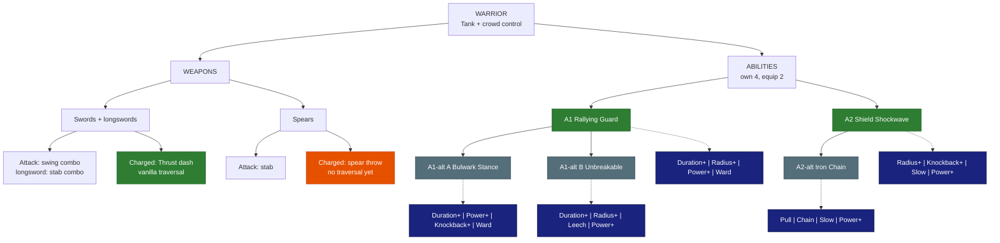

# Warrior - Tank

**Main role:** Tank. **Second role:** crowd control. **Class skill:** Swordsmanship. **Identity:** sturdy, holds mobs, protects the party.
*Numbers are placeholders. Legend in [README.md](README.md).*

## Weapons

| Weapon | Attack | Charged attack / traversal | Status |
|---|---|---|---|
| Swords (incl. longswords) | Vanilla swing combo; longswords a stab combo | Swords: vanilla **Thrust dash** (needs a little Stamina). Longswords: a charged stab with no movement | Sword LOCKED (vanilla); **OPEN**: longswords have no traversal - share the sword's dash? |
| Spears | Vanilla stab | Vanilla **spear throw** (a projectile, no movement) | **OPEN**: needs a traversal. *Proposed:* **Spear Leap** - leap to where you aim and slam down, knocking enemies back |

## Abilities

### A1 - Rallying Guard (LOCKED)
| | |
|---|---|
| Does | You + party within 6 blocks take 20% less damage for 6 s; mobs within 8 blocks turn to attack you for 4 s |
| Levels | +1% damage reduction per level (cap ~30%) |
| Duration+ | +1 s per level |
| Radius+ | +1 block (party and taunt) per level |
| Power+ | +3% damage reduction per level |
| Ward | the party also gets a small shield (5% max Health, +1% per level) |

### A1-alt A - Bulwark Stance (*proposed*, pick A or B)
| | |
|---|---|
| Does | Stance for 8 s: 50% less damage from the front, front projectiles blocked, you move 30% slower; allies right behind you take 25% less |
| Duration+ / Power+ | longer stance / more damage reduction |
| Knockback+ | enemies that hit your front get pushed back |
| Ward | allies behind you also get a small shield |

### A1-alt B - Unbreakable (*proposed*, pick A or B)
| | |
|---|---|
| Does | Taunt mobs within 8 blocks; for 5 s you cannot drop below 1 HP; when it ends you heal 20% of the damage you took during it |
| Duration+ / Radius+ | longer window / bigger taunt |
| Leech | you also heal for part of the damage you deal during it |
| Power+ | the end heal is bigger |

### A2 - Shield Shockwave (LOCKED)
| | |
|---|---|
| Does | Slam your shield: a 6-block cone that stuns enemies ~1.5 s and deals one weapon hit |
| Radius+ | longer cone |
| Knockback+ | stunned enemies are also pushed away |
| Slow | enemies stay slowed after the stun |
| Power+ | longer stun / more damage |

### A2-alt - Iron Chain (*proposed*)
| | |
|---|---|
| Does | Throw a chain up to 15 blocks: it hooks the first enemy, drags it to you and stuns it 1 s (peel mobs off allies, pull archers in) |
| Pull | drags faster, works on bigger mobs |
| Chain | also hooks the nearest enemy next to the first |
| Slow | the dragged enemy stays slowed |
| Power+ | longer stun / more damage |

## Modifier pool - pick 4 for each ability (2 equipped)

| Modifier | What it does | Each level adds |
|---|---|---|
| Duration+ | lasts longer | more time |
| Radius+ | bigger area | more blocks |
| Power+ | stronger main effect (damage, heal, shield, buff) | more % |
| Efficiency | costs less Mana / Stamina | lower cost |
| Split | splits into 3 weaker copies (projectiles, lines) | stronger copies |
| Ricochet | bounces to more targets | +1 bounce |
| Pierce | passes through enemies | +1 enemy |
| Chain | jumps between nearby enemies or allies | +1 jump |
| Lingering | leaves a zone behind (fire, poison, light) | longer zone |
| Slow | adds a slow | stronger slow |
| Knockback+ | pushes enemies away | farther |
| Pull | draws enemies in | stronger pull |
| Follow | a placed zone moves with you instead | bigger zone |
| Leech | heals you for part of the damage | more % |
| Ward | adds a small shield (you, or allies for support abilities) | bigger shield |
| Haste | attack + move speed for a few seconds after use | longer |
| Echo | repeats once after 1 s at reduced strength | stronger echo |

## Class tree paths (ideas, Wynncraft-style - pick one)
- *Guardian* - party protection (bigger Rallying Guard, shield bubble on allies).
- *Warlord* - taunt + counter damage (mobs that hit you get hurt).
- *Juggernaut* - self sustain (heal from blocked hits).

## Open
- Spear traversal (Spear Leap proposed); longsword traversal.
- Engine check: can a mod make mobs target the Warrior (taunt)? If not, Rallying Guard uses a stun instead.

## Change log
- 2026-10-04: modifier pool table added under the abilities (Skyy).
- 2026-10-04: file created from Skyy's locks (Warrior roles + Rallying Guard + Shield Shockwave LOCKED).
