# Concept art index - everything in one place

Cloud draft, 2026-10-06. Paper design; nothing built. One page to review all the concept art. Inputs read: every `research/cloud/*/README.md`,
`docs/answered/gear.md` (lines 69-78), `docs/answered/pets.md` (29-30), `docs/answered/world.md` (52), `CLOUD-RESUME.md`.
Images are relative links, so they render on GitHub / Obsidian. All art is original, drawn by Python + Pillow (deterministic), no game files.

Status words: **approved** = Skyy said so (LOCKED line) / **v2 done** = redone after Skyy's 2026-10-06 art review, waiting for a look /
**waiting on Skyy** = open questions to answer / **not reviewed yet** = Skyy has not commented.

## Review order for Skyy

1. [Weapons v2](#weapons) - most complaints last time (books, soul cage spin, claws, black leather).
2. [Pets v2](#pets) - you liked only the rabbit; check the new box-model look and the dragon icon.
3. [Light armor v2](#light-armor) - new half-mask cowl helmets (Mithril wings).
4. [Foraging v2](#foraging-armor) (new Goldenwood helmet), then [Mining + Farming v2](#mining--farming-armor).
5. [Zone 1 town map v2](#zone-1-town-map) - organic layout, temple at the centre.
6. [Capstone sets](#capstone-set-art) - never reviewed; bureaucracy jokes check.
7. Never reviewed at all: [Fishing gear](#fishing-gear), [Fish species](#fish-species), [Fishing UI mockup](#fishing-ui-mockup),
   [Enchanted](#enchanted-materials), [Class emblems](#class-emblems).
8. Quick confirm only: [Heavy Leather](#heavy-leather), [Crude Robe](#crude-robe), [Accessories](#accessories) (already approved, v2 = detail only).

## At a glance

| Folder | Newest | Status |
|---|---|---|
| `weapon-art/` | v2 | v2 done |
| `pet-art/` | v2 | v2 done |
| `light-armor/` | v2 | design approved, v2 done |
| `foraging-armor/` | v2 | approved, v2 done (Goldenwood helmet) |
| `gathering-armor-art/` | v2 | v2 done (Mining v2, Farming detail) |
| `heavy-armor/` | v2 | approved, v2 done |
| `cloth-armor/` | v2 | approved, v2 done |
| `accessory-art/` | v2 | approved, v2 done |
| `capstone-set-art/` | v2 detail | not reviewed yet |
| `fishing-art/` | v1 | not reviewed yet |
| `enchanted-art/` | v1 (+ touch-up) | not reviewed yet |
| `class-art/` | v1 | not reviewed yet |
| `fish-art/` | v2 touch-up | not reviewed yet |
| `Zone-1-Town-Map.png` | v2 | v2 done |
| `Fishing-UI-Mockup.png` | v1 | not reviewed yet |

## Armor

### Light armor
`research/cloud/light-armor/` - Copper ... Onyxium, black leather + metal accents. Status: **design approved** (gear.md 73), **v2 done**.

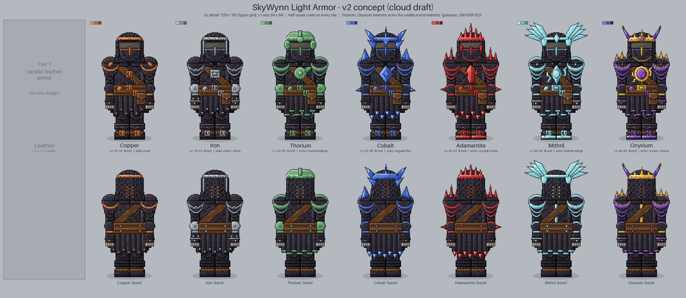

- Also: [helmets-v2](light-armor/helmets-v2.png), per tier `<tier>-set-v2.png` / `<tier>-chest-v2.png` (7 each).
- Older: v1 `light-armor-sheet.png`, `helmets.png`, per-tier v1 files (same names without `-v2`).
- Generators: `make_sheets_v2.py` (v2), `make_sheets.py`, `make_helmets.py` (v1).
- Changed in v2: 2x pixel density and half-mask cowl helmets; Thorium+ echo vanilla metal helmets, Mithril gets the vanilla-style wings.
- Open: 6 questions - [README](light-armor/README.md#questions-for-skyy), v2 notes in [section 7](light-armor/README.md#7-v2---2x-detail--half-mask-cowl-helmets-added-2026-10-06).

### Heavy Leather
`research/cloud/heavy-armor/` - tier 1 Heavy. Status: **approved** ("Both good", gear.md 75), **v2 done** (detail only).

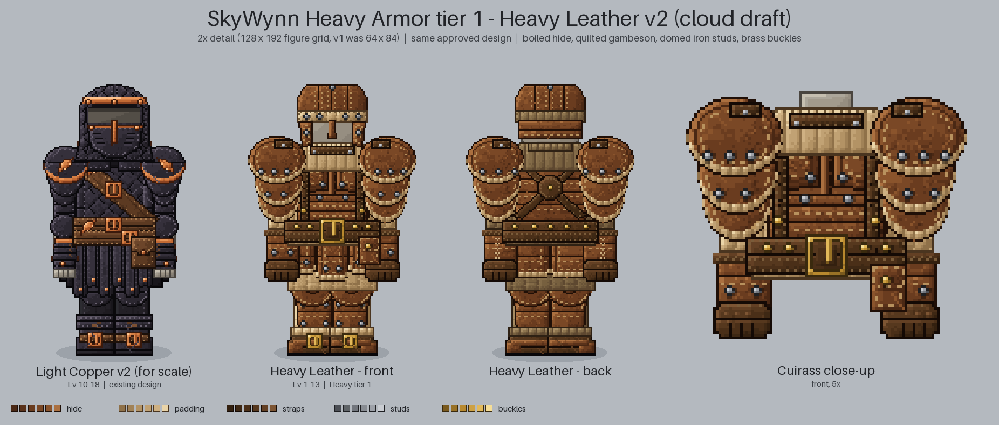

- Also: [heavy-leather-set-v2](heavy-armor/heavy-leather-set-v2.png), [heavy-leather-chest-v2](heavy-armor/heavy-leather-chest-v2.png).
- Older: v1 `heavy-armor-sheet.png`, `heavy-leather-set.png`, `heavy-leather-chest.png`. Generators: `make_heavy_v2.py`, `make_heavy.py`.
- Changed in v2: same design redrawn at 2x (v1 (x, y) -> v2 (2x, 2y + 22)), more stitching / rivets / wear.
- Open: 5 questions - [README](heavy-armor/README.md#for-the-local-session-unverified).

### Crude Robe
`research/cloud/cloth-armor/` - tier 1 Cloth. Status: **approved** (gear.md 75), **v2 done** (detail only).

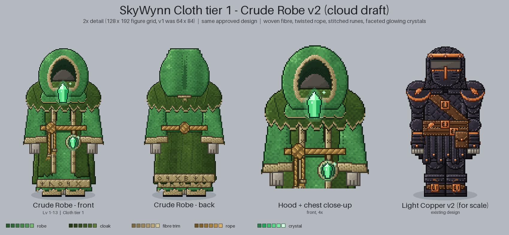

- Also: [crude-robe-set-v2](cloth-armor/crude-robe-set-v2.png), [crude-robe-chest-v2](cloth-armor/crude-robe-chest-v2.png).
- Older: v1 `crude-robe-sheet.png`, `crude-robe-set.png`, `crude-robe-chest.png`. Generators: `make_robe_v2.py`, `make_robe.py`.
- Changed in v2: same design at 2x - hood, clasp, mantle, rope belt + medallion get real texture.
- Open: 5 questions - [README](cloth-armor/README.md#for-the-local-session-unverified).

### Foraging armor
`research/cloud/foraging-armor/` - Softwood ... Goldenwood. Status: **approved** except the Goldenwood helmet (gear.md 76), **v2 done**.

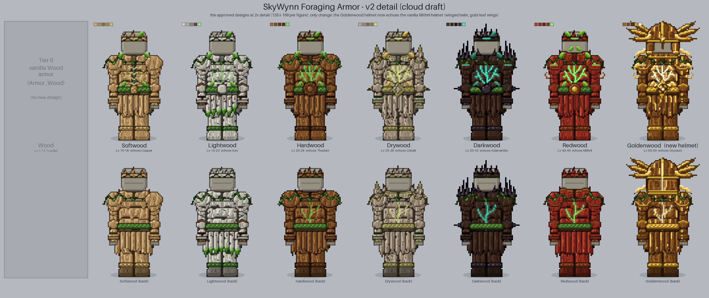

- Also: v1 per-tier sets `softwood-set.png` ... `goldenwood-set.png` (7 files, v1 only).
- Older: v1 `foraging-armor-sheet.png`. Generators: `make_sheets_v2.py`, `make_sheets.py`.
- Changed in v2: 2x detail; Goldenwood helmet redrawn to echo the vanilla Mithril helmet.
- Open: 6 questions + 1 v2 block - [README](foraging-armor/README.md#v2-2026-10-06---detail-pass--new-goldenwood-helmet).

### Mining + Farming armor
`research/cloud/gathering-armor-art/` - Mining Copper ... Onyxium; Farming = crop armor (Wheat ... Onion). Status: Farming look **approved**
(gear.md 70-71), Mining + Farming v2 **done**.

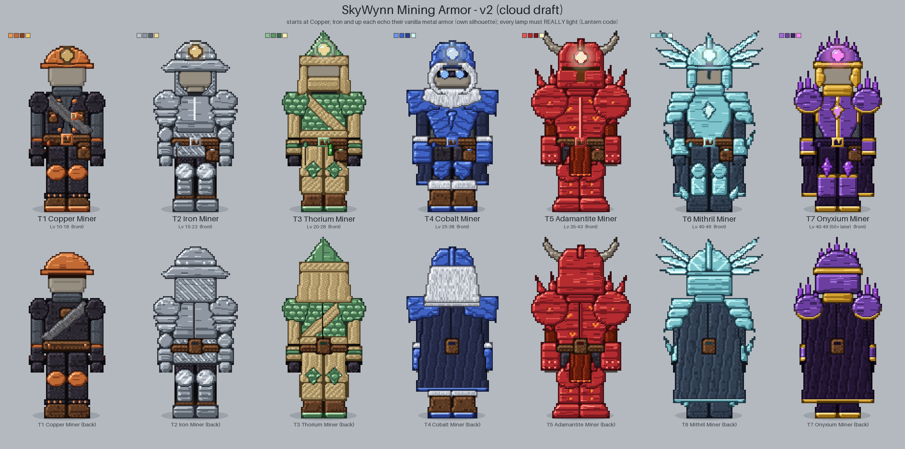
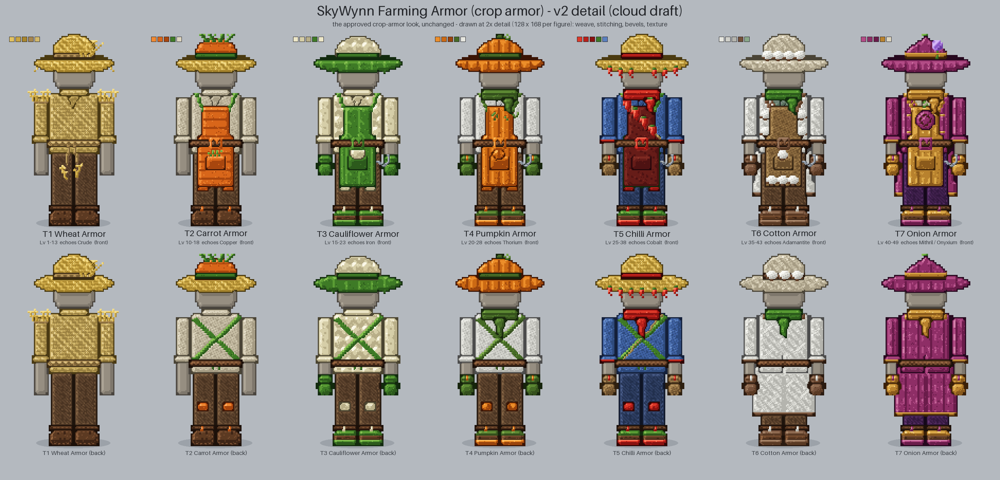

- Older: `mining-sheet.png` (v1), `farming-sheet.png` (v2 crop armor, 2026-10-06 first pass), `farming-sheet-v1.png` (old non-crop farmer).
- Generators: `make_sheets_v2.py [mining] [farming]`, `make_sheets.py`.
- Changed in v2: Mining = same outfit in different colours per tier, iron+ echoes vanilla armor, working-lamp helmets; Farming at 2x detail.
- Open: 9 questions - [README](gathering-armor-art/README.md#questions-for-skyy-v2) (the lamps need real light - local check).

### Capstone set art
`research/cloud/capstone-set-art/` - Department uniforms (Clerk / Bailiff / Notary x Voidglass / Aetherium). Status: **not reviewed yet**.

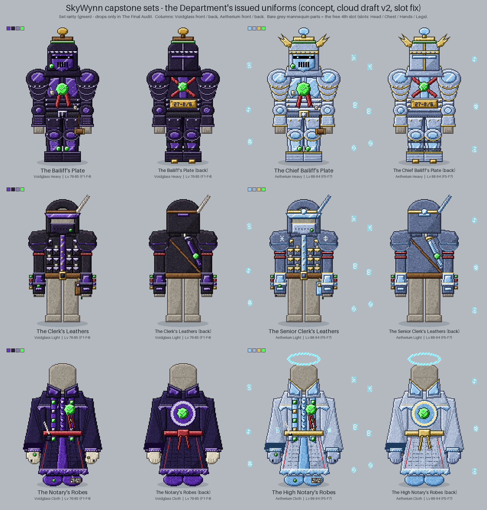

- Also: six single sets, e.g. [clerk-voidglass](capstone-set-art/clerk-voidglass.png), [notary-aetherium](capstone-set-art/notary-aetherium.png).
- Older: `capstone-sets-sheet-v1.png`. Generator: `make_capstone.py`.
- Changed in newest: drawn at the 2x-4x detail from the art review (v2 detail), slot fix per set.
- Open: 5 questions - [README](capstone-set-art/README.md#questions-for-skyy) (bureaucracy jokes, big wax seal, runes only with full set).

## Weapons, pets, accessories

### Weapons
`research/cloud/weapon-art/` - wand, staff, spellbook, soul cage, kunai, bo staff, gauntlets, claws, hand wraps x 7 metals.
Status: **v2 done**, waiting on Skyy (gear.md 74).

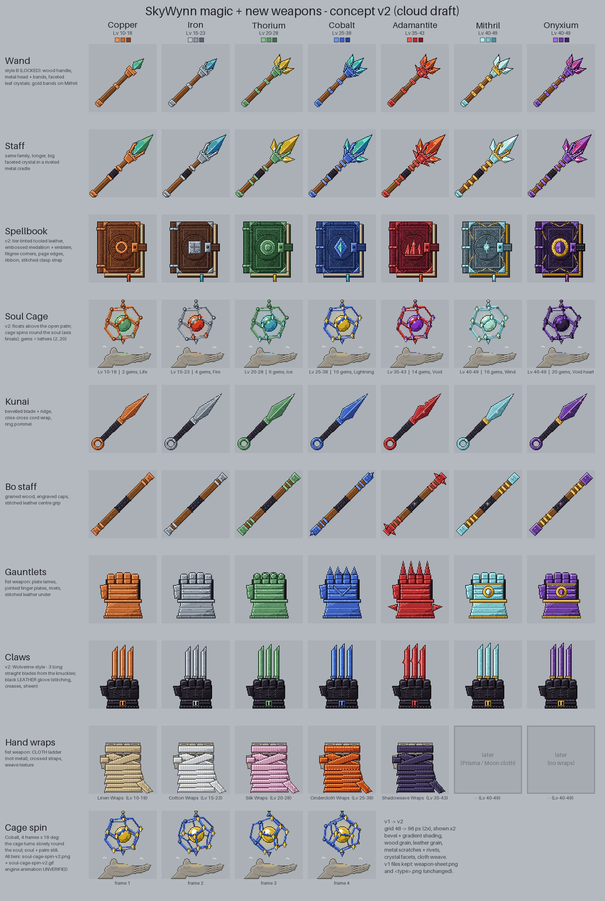

- Also: strips `<type>-v2.png` (9), [soul-cage-spin-v2.png](weapon-art/soul-cage-spin-v2.png), animated [soul-cage-spin-v2.gif](weapon-art/soul-cage-spin-v2.gif).
- Older: v1 `weapon-sheet.png` and `<type>.png` (9). Generators: `make_weapons_v2.py`, `make_weapons.py`.
- Changed in v2: 2x-4x detail, richer spellbook covers, cage floats above the palm and spins slowly, Wolverine-style claws, real black leather.
- Open: 10 questions (8-10 are v2: cover tint, spin speed, claw sockets) - [README](weapon-art/README.md#questions-for-skyy).

### Pets
`research/cloud/pet-art/` - 16 launch pets + dragon (9 elements). Status: **v2 done**, waiting on Skyy (pets.md 29-30: "i dont really like any accept maybe the rabbit").

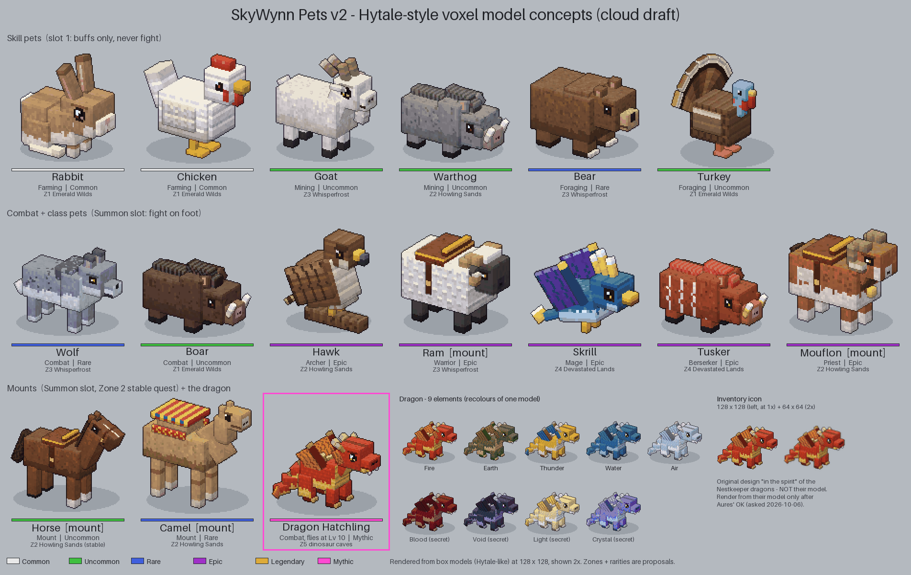

- Also: one card per pet `pet-<name>-v2.png` (16), [dragon-elements-v2](pet-art/dragon-elements-v2.png), dragon icons [128](pet-art/icon-dragon-128-v2.png) / [64](pet-art/icon-dragon-64-v2.png).
- Older: v1 `pet-sheet.png`, `pet-<name>.png`, `dragon-elements.png`. Generators: `make_pets_v2.py`, `make_pets.py`.
- Changed in v2: flat sprites replaced by 3D box-model creatures in the vanilla Hytale style; dragon icon is an original placeholder.
- Open: 9 questions (7-9 are v2) - [README](pet-art/README.md#questions-for-skyy). Dragon icon waits on Aures' OK (pack rule).

### Accessories
`research/cloud/accessory-art/` - 11 kinds x 4 rarities. Status: **approved** ("Love them", gear.md 78), **v2 done** (detail only).

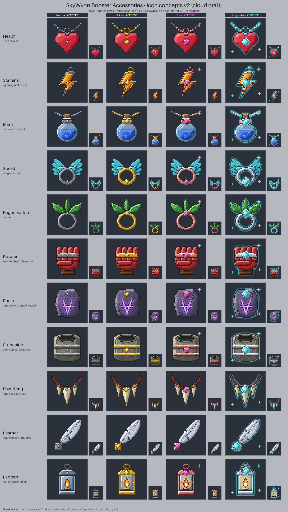

- Also: 44 icons in `icons-v2/<line>-<rarity>.png` (64x64).
- Older: v1 `accessory-sheet.png`, `icons/`. Generators: `make_icons_v2.py`, `make_icons.py`.
- Changed in v2: same 44 designs at vanilla 64x64 density; gem grows with rarity.
- Open: 5 questions - [README](accessory-art/README.md#questions-for-skyy).

## Icons

### Fishing gear
`research/cloud/fishing-art/` - 8 rod / reel tiers + hooks, lines, sinkers. Status: **not reviewed yet** (v1; no density pass yet).

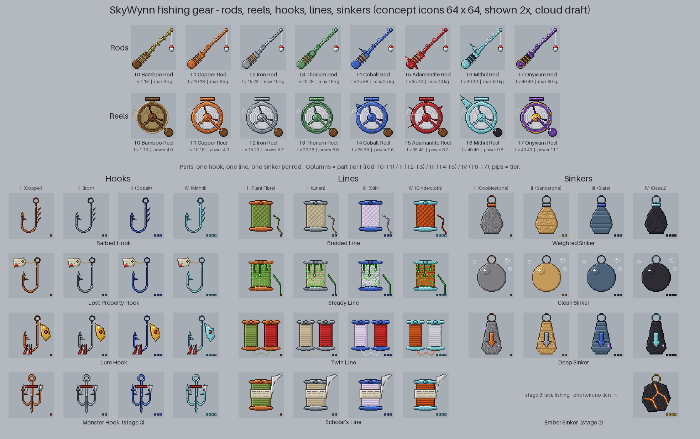

- Also: `icons/`. Generator: `make_fishing.py`. Older: none.
- Changed: first version.
- Open: 4 questions - [README](fishing-art/README.md#questions-for-skyy).

### Fish species
`research/cloud/fish-art/` - one icon per species, rows per zone + Junk + Lost Property. Status: **not reviewed yet**; v2 touch-up done 2026-10-06 (curled eels, flatfish halibut, three distinct sturgeons, clearer Slag Ray).

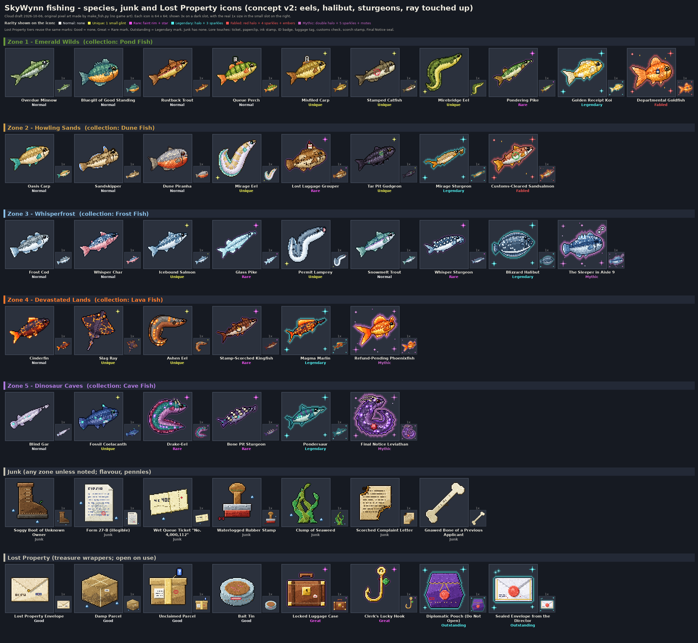

- Also: 54 files in `icons/`. Older: [fish-sheet-v1.png](fish-art/fish-sheet-v1.png). Generator: `make_fish.py`.
- Changed in newest: another agent is updating it (README still says v1) - check its README for the real list.
- Open: 6 questions - [README](fish-art/README.md#questions-for-skyy) (incl. keep the curled eels?).

### Enchanted materials
`research/cloud/enchanted-art/` - 38 items + 15 blocks, SkyBlock-style glint. Status: **not reviewed yet** (Rice / Cotton / Chilli touched up 2026-10-06).

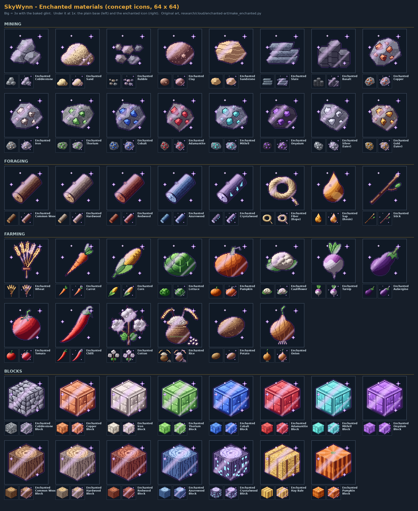

- Also: animated [glint-animated-demo.gif](enchanted-art/glint-animated-demo.gif), `icons/` (64x64). Generator: `make_enchanted.py`. Older: none.
- Changed in newest: touch-up of Rice (sack + panicles) and Cotton (bolls on a stem).
- Open: 4 questions - [README](enchanted-art/README.md#questions-for-skyy).

### Class emblems
`research/cloud/class-art/` - 7 classes, 64 and 128 px + locked 64 px. Status: **not reviewed yet**.

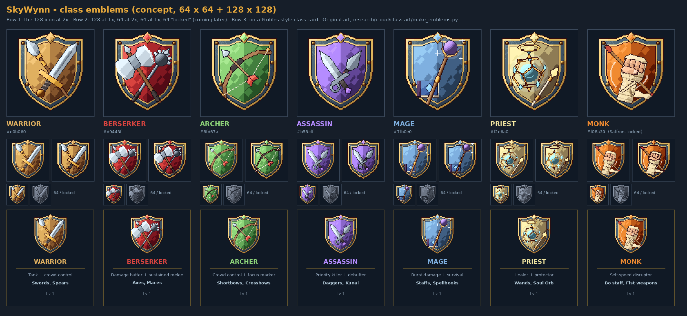

- Also: `icons/class-<name>-{64,64-locked,128}.png`. Generator: `make_emblems.py`. Older: none.
- Monk colour options: [monk-colour-options.png](class-art/monk-colour-options.png) - 6 candidates; recommended Jade teal `#38c9a8` ([research/cloud/Monk-Colour-Options.md](Monk-Colour-Options.md)).
- Open: 4 questions - [README](class-art/README.md#questions-for-skyy).

## Maps and screens

### Zone 1 town map
`research/cloud/Zone-1-Town-Map.png` (1600 x 1112, v2). Status: **v2 done**, waiting on Skyy (world.md 52: "too square, look at skyblocks hub", vanilla temple stays at the centre).

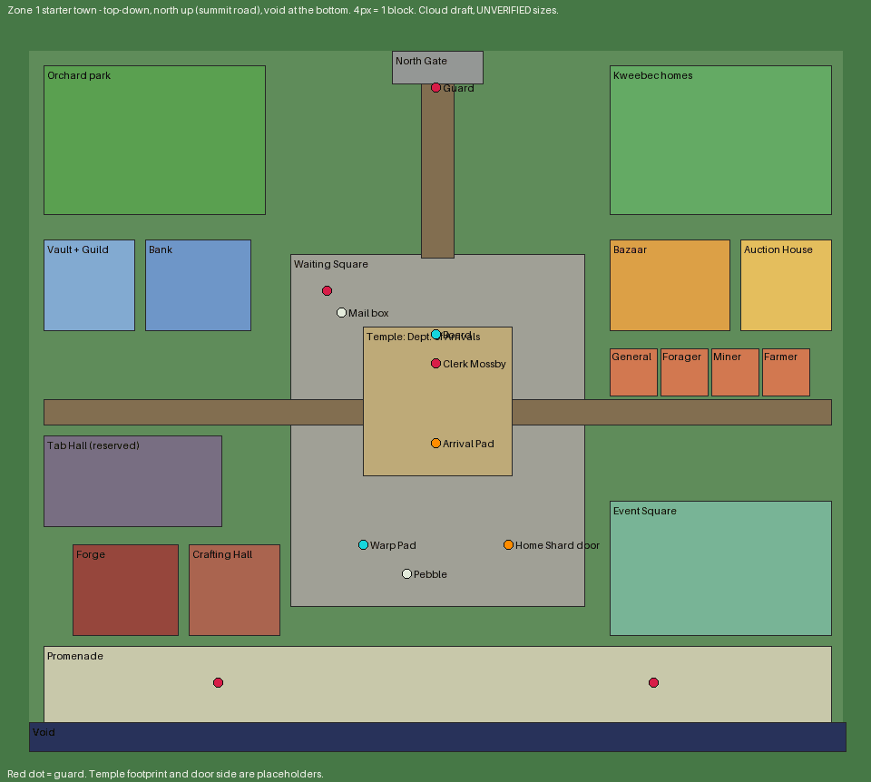

- Older: [Zone-1-Town-Map-v1.png](Zone-1-Town-Map-v1.png) (square). Generator: `zone1_town_map.py`. Spec: [Zone-1-Town-Layout.md](Zone-1-Town-Layout.md).
- Changed in v2: organic winding roads and irregular plazas, temple at the centre behind spawn, contour lines, 19 numbered markers.
- Open: see the questions table in [Zone-1-Town-Layout.md](Zone-1-Town-Layout.md).

### Fishing UI mockup
`research/cloud/Fishing-UI-Mockup.png`. Status: **not reviewed yet**.

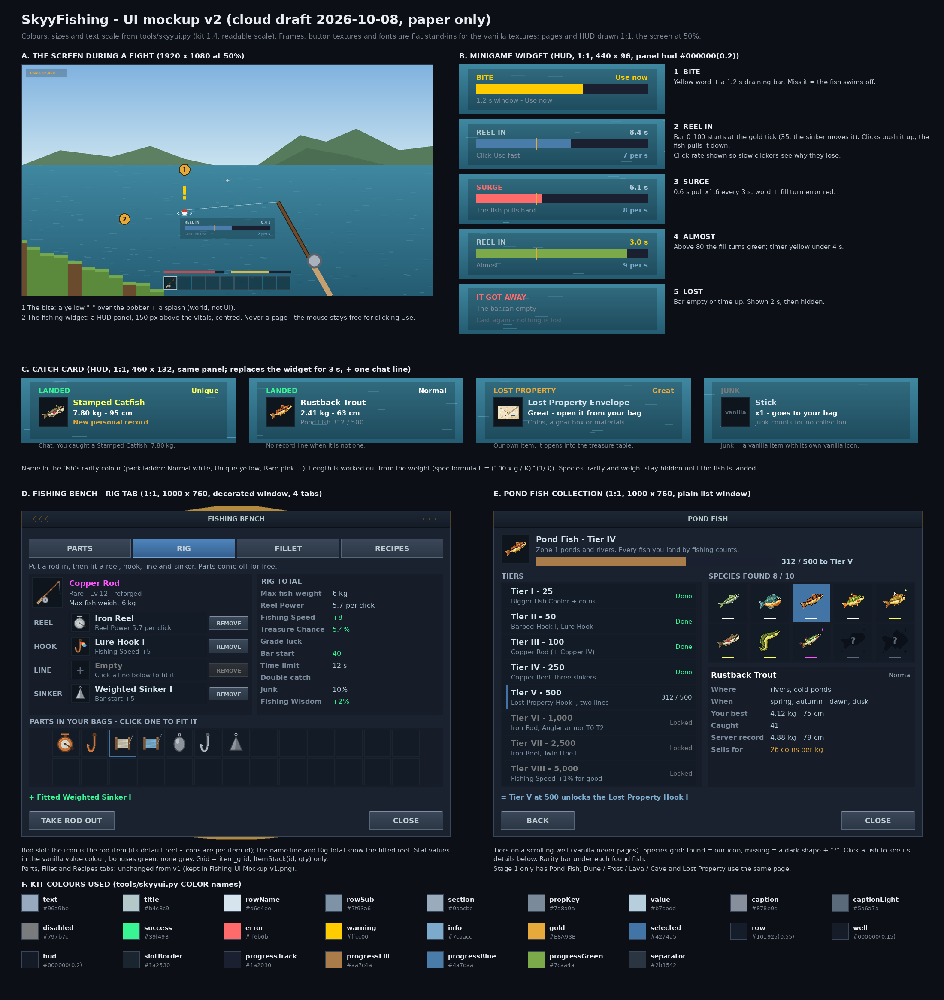

- Generator: `fishing_ui_mockup.py`. Older: none. Spec: [Fishing-UI-Mockup.md](Fishing-UI-Mockup.md) (open questions are in its table).

## How to regenerate

From the repo root, no game files needed (Python 3 + Pillow, deterministic - same code gives the same bytes):

```
python3 research/cloud/<folder>/<generator>.py
```

Use the newest generator named in each entry (the `_v2` script where one exists). v2 scripts import the v1 script read-only, so keep both.
Before overwriting a sheet that Skyy has seen, rename the old PNG to `<name>-v1.png`. Outputs stay under 2 MB per folder and under ~4000 px wide.

## For the local session (UNVERIFIED)

| # | Item |
|---|---|
| 1 | Page written from file names and READMEs; sheets were not opened visually here. Fish v2 README checked. |
| 2 | All vanilla-density claims (Chest 192x64 etc.) come from Skyy's lock lines, not from the game files. |

## Questions for Skyy

| # | Question | Default |
|---|---|---|
| 1 | Is this review order right, or do you want it by system (armor / weapons / fishing)? | as listed |
| 2 | Which Monk class colour? (see `research/cloud/Monk-Colour-Options.md`) | Jade teal `#38c9a8` |
| 3 | Should the never-reviewed v1 folders (fishing gear, fish, enchanted, classes) get the 2x-4x density pass too? | yes, same rule as the rest |
